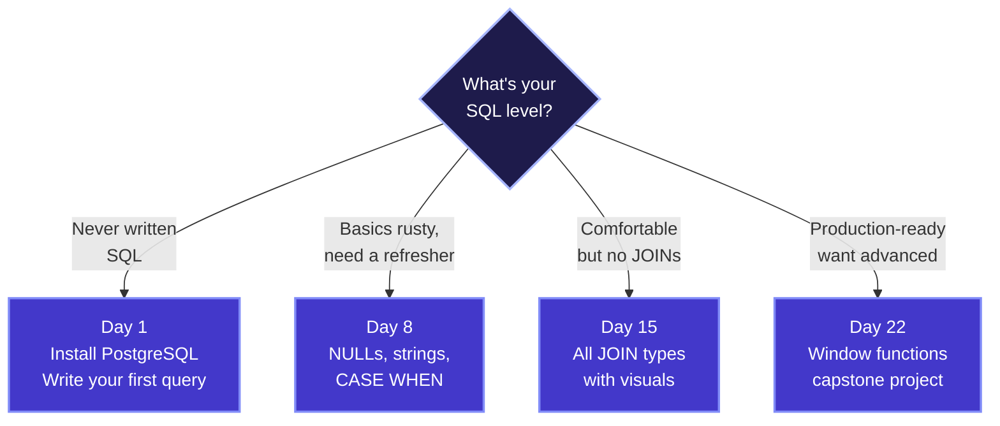
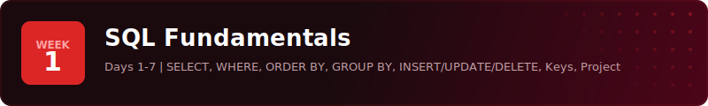
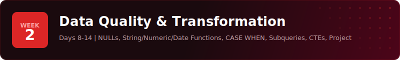
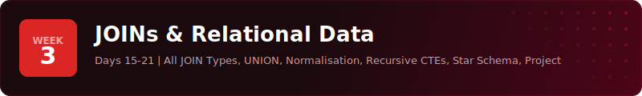
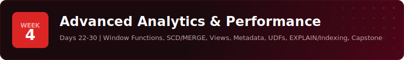
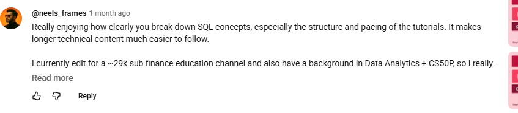
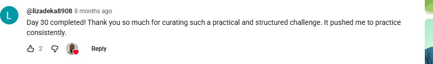

<p align="center">
  <a href="https://www.youtube.com/playlist?list=PL92LwdfbhlXF4qeI8P4bMKepuEPGtKFWx"></a>
</p>

<p align="center">
  <a href="https://www.youtube.com/playlist?list=PL92LwdfbhlXF4qeI8P4bMKepuEPGtKFWx"></a>
  <a href="https://www.youtube.com/@sdw-online"></a>
  
  
  
</p>

<p align="center">
  <b>By Day 30, you'll be the SQL person on your team.</b><br>
  The one others ask. The one who reads queries fast. The one who debugs the reports nobody else can fix.<br>
  This is the 30-day structure that gets you there - daily lessons, real datasets, real exercises.
</p>

<!-- PROGRESS-GRID -->
<p align="center"><sub><b>17 OF 30</b> &nbsp;&middot;&nbsp; <i>tap any tile to start watching</i></sub></p>

<table align="center" cellpadding="3" cellspacing="0" border="0">
  <tr>
    <td align="center" valign="middle"><a href="https://www.youtube.com/watch?v=mFIMPhiO-N0" title="Day 1: Introduction to SQL & Databases"></a></td>
    <td align="center" valign="middle"><a href="https://www.youtube.com/watch?v=-0uVBtXCZ_s" title="Day 2: SELECT & WHERE"></a></td>
    <td align="center" valign="middle"><a href="https://www.youtube.com/watch?v=s86nI9dPZqY" title="Day 3: ORDER BY & LIMIT"></a></td>
    <td align="center" valign="middle"><a href="https://www.youtube.com/watch?v=7IWrvTIrIkg" title="Day 4: Aggregate Functions & GROUP BY"></a></td>
    <td align="center" valign="middle"><a href="https://www.youtube.com/watch?v=NJ4ujmOZt60" title="Day 5: INSERT, UPDATE & DELETE"></a></td>
    <td align="center" valign="middle"><a href="https://www.youtube.com/watch?v=1AdFU8Vdq-0" title="Day 6: Primary & Foreign Keys"></a></td>
    <td align="center" valign="middle"><a href="https://youtu.be/fiBYAziNtGI" title="Day 7: Project: Freight & Logistics Report"></a></td>
    <td align="center" valign="middle"><a href="https://www.youtube.com/watch?v=0nH464EoZ9w" title="Day 8: NULL Handling"></a></td>
    <td align="center" valign="middle"><a href="https://www.youtube.com/watch?v=h6J7AajBD6w" title="Day 9: String & Numeric Functions"></a></td>
    <td align="center" valign="middle"><a href="https://youtu.be/Iturx2kgs1A" title="Day 10: Date Functions & CAST"></a></td>
  </tr>
  <tr>
    <td align="center" valign="middle"><a href="https://youtu.be/eZ5iTTsKGkI" title="Day 11: CASE WHEN"></a></td>
    <td align="center" valign="middle"><a href="https://youtu.be/SOt5jUrzKOU" title="Day 12: Subqueries & Temp Tables"></a></td>
    <td align="center" valign="middle"><a href="https://youtu.be/IijQJAfqcJc" title="Day 13: CTEs (Part 1)"></a></td>
    <td align="center" valign="middle"><a href="https://youtu.be/afIJ4VsQYSo" title="Day 14: Project: Fleet Intelligence Pipeline"></a></td>
    <td align="center" valign="middle"><a href="https://youtu.be/wtBxs_iDLo4" title="Day 15: JOINs Part 1: INNER, LEFT, RIGHT, FULL OUTER"></a></td>
    <td align="center" valign="middle"><a href="https://youtu.be/ZYwPGw4ghkI" title="Day 16: JOINs Part 2: CROSS & Self Joins"></a></td>
    <td align="center" valign="middle"><a href="https://youtu.be/wlohArgOSd4" title="Day 17: UNION & UNION ALL"></a></td>
    <td align="center" valign="middle"><a href="https://github.com/sdw-online/30-Day-SQL-Challenge#curriculum" title="Day 18: Normalisation & Denormalisation"></a></td>
    <td align="center" valign="middle"><a href="https://github.com/sdw-online/30-Day-SQL-Challenge#curriculum" title="Day 19: Recursive CTEs"></a></td>
    <td align="center" valign="middle"><a href="https://github.com/sdw-online/30-Day-SQL-Challenge#curriculum" title="Day 20: Data Modelling (Star Schema)"></a></td>
  </tr>
  <tr>
    <td align="center" valign="middle"><a href="https://github.com/sdw-online/30-Day-SQL-Challenge#curriculum" title="Day 21: Project: SaaS Trial-to-Paid Conversion"></a></td>
    <td align="center" valign="middle"><a href="https://github.com/sdw-online/30-Day-SQL-Challenge#curriculum" title="Day 22: Window Functions Part 1"></a></td>
    <td align="center" valign="middle"><a href="https://github.com/sdw-online/30-Day-SQL-Challenge#curriculum" title="Day 23: Window Functions Part 2"></a></td>
    <td align="center" valign="middle"><a href="https://github.com/sdw-online/30-Day-SQL-Challenge#curriculum" title="Day 24: SCD Types & MERGE"></a></td>
    <td align="center" valign="middle"><a href="https://github.com/sdw-online/30-Day-SQL-Challenge#curriculum" title="Day 25: Views & Materialised Views"></a></td>
    <td align="center" valign="middle"><a href="https://github.com/sdw-online/30-Day-SQL-Challenge#curriculum" title="Day 26: Information Schema & Metadata"></a></td>
    <td align="center" valign="middle"><a href="https://github.com/sdw-online/30-Day-SQL-Challenge#curriculum" title="Day 27: CREATE FUNCTION (UDFs)"></a></td>
    <td align="center" valign="middle"><a href="https://github.com/sdw-online/30-Day-SQL-Challenge#curriculum" title="Day 28: EXPLAIN & Indexing"></a></td>
    <td align="center" valign="middle"><a href="https://github.com/sdw-online/30-Day-SQL-Challenge#curriculum" title="Day 29: PostgreSQL Pro Tips"></a></td>
    <td align="center" valign="middle"><a href="https://github.com/sdw-online/30-Day-SQL-Challenge#curriculum" title="Day 30: Capstone: FinTech Lending Analytics"></a></td>
  </tr>
</table>

<p align="center"><sub><i>Tap any unlit tile to see what is coming.</i></sub></p>
<!-- /PROGRESS-GRID -->

---

## How it works

Five steps. Every day. Thirty days.


Each day gives you:
- A **video lesson** walking through the concept with real examples
- A **dataset** you set up yourself in pgAdmin - you build the tables, not just read about them
- **Exercises** that drop you into a real role solving a real problem
- **Solutions** so you can check your work and see how you did

---

## Why This Challenge?

<p align="center">
  <a href="guides/why-this-challenge.md"></a>
</p>

**You don't get good at SQL by watching someone else write it.** You get good by writing it yourself, every day, with data you can actually see and query. That's what this challenge is built around - not theory, not slides, just you and a database.

**30 minutes a day beats a weekend bootcamp.** It's tempting to binge-watch a 12-hour course on a Saturday and call it done. But that's exposure, not skill. When you write SQL every single day for 30 days, it stops being something you "learnt once" and becomes something you just know. The consistency is the point.

**Every exercise puts you in a real job.** You're not answering textbook questions here. You're a data analyst at a regional education authority. You're an analytics engineer at a logistics company. You're debugging a fintech lending pipeline. The scenarios are modelled on real work - logistics, healthcare, finance, infrastructure - so when you do land that role, nothing feels unfamiliar.

---

## "But can't AI write SQL for me?"

<p align="center">
  <a href="guides/sql-in-the-ai-era.md"></a>
</p>

Sure, AI can generate SQL. But here's what it can't do: guarantee the output is correct, performant, or even answering the right question. And when it gets it wrong - which it regularly does - someone needs to spot the mistake, understand why it happened, and fix it. That someone needs SQL fluency.

But honestly, the AI argument misses the bigger picture. SQL isn't just a language you type into a database. It's a way of thinking:

- **It teaches you to decompose problems.** Every complex query starts as a vague question like "which schools are underperforming?" You learn to break that down - what does underperforming mean? Compared to what? Over what time period? SQL forces you to be specific, and that skill transfers to everything you do with data.
- **It teaches you to be precise.** A database won't guess what you meant. If your logic is wrong, your results are wrong - silently. You learn to think about edge cases, NULLs, duplicates, and assumptions. That kind of rigour makes you a better analyst, engineer, and thinker.
- **It gives you direct access to the truth.** When someone says "revenue is up 20%", you can check. When a dashboard looks wrong, you can query the source yourself. SQL removes the middleman between you and the data - and that's powerful in any role.

AI makes SQL faster to write. This challenge makes you someone who knows what to write - and when AI gets it wrong.

---

## Where should I start?

Not everyone's starting from scratch - and that's fine. Pick the door that matches where you are.



<sub><i>Click any node to jump straight to that day's folder.</i></sub>

If diagrams don't render in your client, here's the short version:

- **Never written SQL?** → [Day 1](./day-01) - PostgreSQL setup + your first query
- **Basics rusty?** → [Day 8](./day-08) - Week 2 covers what most people forget first
- **Comfortable but no JOINs?** → [Day 15](./day-15) - where most people in data jobs realise they've been winging it
- **Already use SQL at work?** → [Day 22](./day-22) - window functions, MERGE, query optimisation, capstone

---

<p align="center">
  <a href="https://data100x.carrd.co/"></a>
</p>

---

## Curriculum

<br>

<a href="day-01/"></a>

<br>

| Day | Topic | What You'll Do | Video |
|:---:|-------|----------------|:-----:|
| 01 | Introduction to SQL & Databases | Set up PostgreSQL, create your first database, and run your first query<br><sub><i>Introduction to SQL & Databases - the thing most people get wrong.</i></sub> | [Watch](https://www.youtube.com/watch?v=mFIMPhiO-N0) |
| 02 | SELECT & WHERE | Pull specific data from a table and filter rows using conditions<br><sub><i>The single most-used SQL clause. Get it wrong, get nothing.</i></sub> | [Watch](https://www.youtube.com/watch?v=-0uVBtXCZ_s) |
| 03 | ORDER BY & LIMIT | Sort your results and control how many rows come back<br><sub><i>Sorting is easy. Sorting NULLs the right way is not.</i></sub> | [Watch](https://www.youtube.com/watch?v=s86nI9dPZqY) |
| 04 | Aggregate Functions & GROUP BY | Count, sum, and average your data - then group it to find patterns<br><sub><i>Aggregates have one trap that turns reports into lies.</i></sub> | [Watch](https://www.youtube.com/watch?v=7IWrvTIrIkg) |
| 05 | INSERT, UPDATE & DELETE | Add new rows, change existing ones, and remove what you don't need<br><sub><i>The day your habits decide whether prod survives the week.</i></sub> | [Watch](https://www.youtube.com/watch?v=NJ4ujmOZt60) |
| 06 | Primary & Foreign Keys | Understand how tables relate to each other and why constraints matter<br><sub><i>Primary & Foreign Keys - the thing most people get wrong.</i></sub> | [Watch](https://www.youtube.com/watch?v=1AdFU8Vdq-0) |
| 07 | **Project:** Freight & Logistics Report | Put it all together - build a performance report from real shipping data<br><sub><i>The day you stop learning and start building.</i></sub> | [Watch](https://youtu.be/fiBYAziNtGI) |

<br>

<a href="day-08/"></a>

<br>

| Day | Topic | What You'll Do | Video |
|:---:|-------|----------------|:-----:|
| 08 | NULL Handling | Deal with missing data without breaking your queries<br><sub><i>NULL is not zero. Get this wrong and your aggregates lie.</i></sub> | [Watch](https://www.youtube.com/watch?v=0nH464EoZ9w) |
| 09 | String & Numeric Functions | Clean messy text, extract parts of strings, and round numbers properly<br><sub><i>Messy text is everywhere. The fix is one chapter away.</i></sub> | [Watch](https://www.youtube.com/watch?v=h6J7AajBD6w) |
| 10 | Date Functions & CAST | Work with dates, calculate time differences, and convert between types<br><sub><i>Dates have more traps than any other type. Spot them before they spot you.</i></sub> | [Watch](https://youtu.be/Iturx2kgs1A) |
| 11 | CASE WHEN | Add conditional logic to your queries - like if/else but inside SQL<br><sub><i>Most people overuse CASE WHEN. There is a cleaner way.</i></sub> | [Watch](https://youtu.be/eZ5iTTsKGkI) |
| 12 | Subqueries & Temp Tables | Nest queries inside each other and store intermediate results for reuse<br><sub><i>Subqueries & Temp Tables - the thing most people get wrong.</i></sub> | [Watch](https://youtu.be/SOt5jUrzKOU) |
| 13 | CTEs (Part 1) | Write cleaner, more readable queries using Common Table Expressions<br><sub><i>CTEs are why your seniors read SQL faster than you. Yet.</i></sub> | [Watch](https://youtu.be/IijQJAfqcJc) |
| 14 | **Project:** Fleet Intelligence Pipeline | Build a multi-step data pipeline using everything from Week 2<br><sub><i>The day you stop learning and start building.</i></sub> | [Watch](https://youtu.be/afIJ4VsQYSo) |

<br>

<a href="day-15/"></a>

<br>

| Day | Topic | What You'll Do | Video |
|:---:|-------|----------------|:-----:|
| 15 | JOINs Part 1: INNER, LEFT, RIGHT, FULL OUTER | Connect tables together and understand what each JOIN type keeps and drops<br><sub><i>JOINs look easy until they silently drop your data.</i></sub> | [Watch](https://youtu.be/wtBxs_iDLo4) |
| 16 | JOINs Part 2: CROSS & Self Joins | Generate combinations and compare rows within the same table<br><sub><i>JOINs look easy until they silently drop your data.</i></sub> | [Watch](https://youtu.be/ZYwPGw4ghkI) |
| 17 | UNION & UNION ALL | Stack result sets on top of each other and know when to deduplicate<br><sub><i>UNION & UNION ALL - the thing most people get wrong.</i></sub> |[Watch](https://youtu.be/wlohArgOSd4)|
| 18 | Normalisation & Denormalisation | Understand why databases split data across tables - and when to flatten it<br><sub><i>The rule that decides whether your schema scales or rots.</i></sub> | Coming soon |
| 19 | Recursive CTEs | Query hierarchical data like org charts and category trees<br><sub><i>CTEs are why your seniors read SQL faster than you. Yet.</i></sub> | Coming soon |
| 20 | Data Modelling (Star Schema) | Design fact and dimension tables the way analytics teams actually do it<br><sub><i>How analytics teams actually structure data. Not how textbooks teach it.</i></sub> | Coming soon |
| 21 | **Project:** SaaS Trial-to-Paid Conversion | Analyse a real SaaS funnel - which trials convert and why<br><sub><i>The day you stop learning and start building.</i></sub> | Coming soon |

<br>

<a href="day-22/"></a>

<br>

| Day | Topic | What You'll Do | Video |
|:---:|-------|----------------|:-----:|
| 22 | Window Functions Part 1 | Rank rows, number them, and calculate running totals without GROUP BY<br><sub><i>Window functions replace 80% of the SQL you used to write.</i></sub> | Coming soon |
| 23 | Window Functions Part 2 | Compare current rows to previous ones with LAG, LEAD, and QUALIFY<br><sub><i>Window functions replace 80% of the SQL you used to write.</i></sub> | Coming soon |
| 24 | SCD Types & MERGE | Track how data changes over time and upsert rows in one statement<br><sub><i>SCD Types & MERGE - the thing most people get wrong.</i></sub> | Coming soon |
| 25 | Views & Materialised Views | Save queries as reusable objects and pre-compute expensive results<br><sub><i>Views & Materialised Views - the thing most people get wrong.</i></sub> | Coming soon |
| 26 | Information Schema & Metadata | Query the database about itself - table sizes, column types, constraints<br><sub><i>Bad charts hide insight. Good ones force it.</i></sub> | Coming soon |
| 27 | CREATE FUNCTION (UDFs) | Build your own reusable SQL functions for logic you use repeatedly<br><sub><i>CREATE FUNCTION (UDFs) - the thing most people get wrong.</i></sub> | Coming soon |
| 28 | EXPLAIN & Indexing | Read query plans, spot bottlenecks, and make your queries faster<br><sub><i>Lookups separate the spreadsheet person from everyone else.</i></sub> | Coming soon |
| 29 | PostgreSQL Pro Tips | Shortcuts, settings, and techniques that save time every day<br><sub><i>The small habits separating slow from fast.</i></sub> | Coming soon |
| 30 | **Capstone:** FinTech Lending Analytics | Build a full analytics platform - schema, pipelines, segmentation, tuning<br><sub><i>Capstone: FinTech Lending Analytics - the thing most people get wrong.</i></sub> | Coming soon |

---

## Quick Start

**All you need is a computer and an internet connection.** Seriously, that's it.

**Step 1** - Install PostgreSQL & pgAdmin ([watch the setup guide](https://youtu.be/g8GwhsVPaOg) - takes about 10 minutes)

**Step 2** - Clone this repo
```bash
git clone https://github.com/sdw-online/30-Day-SQL-Challenge.git
```

**Step 3** - Create your database
```sql
CREATE DATABASE sql_challenge;
```

**Step 4** - Open [`day-01/`](day-01/) and you're off

---

## What People Are Saying

Real comments from people doing the challenge right now.

<p align="center">
  
</p>

<p align="center">
  
  &nbsp;&nbsp;
  
</p>

<p align="center">
  
  &nbsp;&nbsp;
  
</p>

<p align="center">
  
</p>

---

## Other Installation Guides

Need to set up other tools? These walk you through each one step by step:

| Tool | Guide |
|------|:-----:|
| PostgreSQL & pgAdmin | [Watch](https://youtu.be/g8GwhsVPaOg) |
| MySQL & Workbench | [Watch](https://youtu.be/u8gGLYOhJuA) |
| SQL Server & SSMS | [Watch](https://youtu.be/Th0hB2h7F14) |
| VS Code | [Watch](https://youtu.be/ny-uBrcGP_U) |
| Git | [Watch](https://youtu.be/26moiTYEw6I) |
| Docker | [Watch](https://youtu.be/6KWp6pNAVLU) |

---

<!-- BROWSE-ALL-VIDEOS -->
## Browse all videos

<sub>Click any thumbnail to jump straight to that day's video on YouTube. Sorted by day number.</sub>

<table>
<tr>
<td align="center" width="33%">
  <a href="https://www.youtube.com/watch?v=mFIMPhiO-N0"></a><br/>
  <sub><b>Day 01 - Introduction to SQL &amp; Databases</b></sub>
</td>
<td align="center" width="33%">
  <a href="https://www.youtube.com/watch?v=-0uVBtXCZ_s"></a><br/>
  <sub><b>Day 02 - SELECT &amp; WHERE</b></sub>
</td>
<td align="center" width="33%">
  <a href="https://www.youtube.com/watch?v=s86nI9dPZqY"></a><br/>
  <sub><b>Day 03 - ORDER BY &amp; LIMIT</b></sub>
</td>
</tr>
<tr>
<td align="center" width="33%">
  <a href="https://www.youtube.com/watch?v=7IWrvTIrIkg"></a><br/>
  <sub><b>Day 04 - Aggregate Functions &amp; GROUP BY</b></sub>
</td>
<td align="center" width="33%">
  <a href="https://www.youtube.com/watch?v=NJ4ujmOZt60"></a><br/>
  <sub><b>Day 05 - INSERT, UPDATE &amp; DELETE</b></sub>
</td>
<td align="center" width="33%">
  <a href="https://www.youtube.com/watch?v=1AdFU8Vdq-0"></a><br/>
  <sub><b>Day 06 - Primary &amp; Foreign Keys</b></sub>
</td>
</tr>
<tr>
<td align="center" width="33%">
  <a href="https://www.youtube.com/watch?v=fiBYAziNtGI"></a><br/>
  <sub><b>Day 07 - Project: Freight &amp; Logistics Report</b></sub>
</td>
<td align="center" width="33%">
  <a href="https://www.youtube.com/watch?v=0nH464EoZ9w"></a><br/>
  <sub><b>Day 08 - NULL Handling</b></sub>
</td>
<td align="center" width="33%">
  <a href="https://www.youtube.com/watch?v=h6J7AajBD6w"></a><br/>
  <sub><b>Day 09 - String &amp; Numeric Functions</b></sub>
</td>
</tr>
<tr>
<td align="center" width="33%">
  <a href="https://www.youtube.com/watch?v=Iturx2kgs1A"></a><br/>
  <sub><b>Day 10 - Date Functions &amp; CAST</b></sub>
</td>
<td align="center" width="33%">
  <a href="https://www.youtube.com/watch?v=eZ5iTTsKGkI"></a><br/>
  <sub><b>Day 11 - CASE WHEN</b></sub>
</td>
<td align="center" width="33%">
  <a href="https://www.youtube.com/watch?v=SOt5jUrzKOU"></a><br/>
  <sub><b>Day 12 - Subqueries &amp; Temp Tables</b></sub>
</td>
</tr>
<tr>
<td align="center" width="33%">
  <a href="https://www.youtube.com/watch?v=IijQJAfqcJc"></a><br/>
  <sub><b>Day 13 - CTEs (Part 1)</b></sub>
</td>
<td align="center" width="33%">
  <a href="https://www.youtube.com/watch?v=afIJ4VsQYSo"></a><br/>
  <sub><b>Day 14 - Project: Fleet Intelligence Pipeline</b></sub>
</td>
<td align="center" width="33%">
  <a href="https://www.youtube.com/watch?v=wtBxs_iDLo4"></a><br/>
  <sub><b>Day 15 - JOINs Part 1: INNER, LEFT, RIGHT, FULL OUTER</b></sub>
</td>
</tr>
<tr>
<td align="center" width="33%">
  <a href="https://www.youtube.com/watch?v=ZYwPGw4ghkI"></a><br/>
  <sub><b>Day 16 - JOINs Part 2: CROSS &amp; Self Joins</b></sub>
</td>
<td align="center" width="33%">
  <a href="https://www.youtube.com/watch?v=wlohArgOSd4"></a><br/>
  <sub><b>Day 17 - UNION &amp; UNION ALL</b></sub>
</td>
</tr>
</table>

<!-- BROWSE-ALL-VIDEOS -->

---

## Join the community

<p align="center">
  <a href="https://data100x.carrd.co/"><strong>Join the free data community →</strong></a><br/>
  <sub>Weekly drops, member projects, no spam, 100% free.</sub>
</p>

<p align="center"><sub>
  Want the deeper material? <a href="https://davidwilliams2.gumroad.com/l/cxypl"><b>SQL Made Easy</b></a> on Gumroad.
</sub></p>

---

<p align="center">
  <a href="https://www.youtube.com/@sdw-online?sub_confirmation=1"></a>
</p>

You just mass-gained a skill most people spend months fumbling through. Stephen drops new challenges, projects, and deep dives regularly - [subscribe on YouTube](https://www.youtube.com/@sdw-online?sub_confirmation=1) so you don't miss the next one.

That's how people go from "learning SQL" to being the SQL person on the team.

---

## About

I'm Stephen - a Senior Data Engineer who's worked across consulting, startups, and enterprise (BDO, TCS, easyJet, C. Hoare & Co., Veolia UK/US).

I've spent years doing this work professionally, and I created this challenge to pass on what I've learnt - the practical stuff, not the theory. The kind of SQL you actually write on the job. Thousands of people have gone through the Excel and SQL challenges already, and watching people message me saying they got their first data role because of these videos is genuinely why I keep doing it.

**YouTube:** [Stephen | Data](https://www.youtube.com/@sdw-online?sub_confirmation=1)

---

## License

For educational purposes. Fork it, clone it, learn from it. If you share it, a link back is appreciated.


