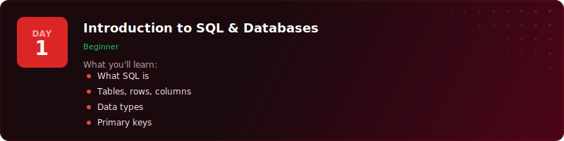
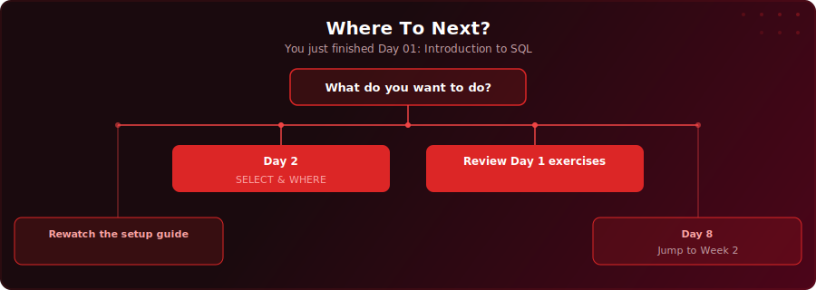

<p align="center">
  <a href="https://www.youtube.com/watch?v=mFIMPhiO-N0"></a>
</p>

<p align="center">
  <a href="https://www.youtube.com/watch?v=mFIMPhiO-N0"></a>
  
  
  
</p>

# Day 1 - Introduction to SQL & Databases

Start of challenge | [Day 2: SELECT & WHERE >>](../day-02/)

---

## What You'll Learn

- What SQL is and why every data role uses it daily
- How databases organise data into tables, rows, and columns
- The four essential data types: VARCHAR, INTEGER, DATE, and BOOLEAN
- What primary keys are and why every table needs one
- How to set up PostgreSQL and pgAdmin on your machine

---

## Quick Setup

```sql
-- Run in pgAdmin (takes a few seconds)
\i setup.sql
```

Or open [`setup.sql`](setup.sql) and run the full script manually.

<details>
<summary>Verify your setup</summary>

```sql
-- Check your tables loaded correctly
SELECT COUNT(*) FROM your_table;
```

</details>

---

## Exercises

You've just joined TechCorp as a junior data analyst. It's your first day. Your manager, Priya, the Head of Analytics, sends you a message:

> "Welcome to the team! Before you can start querying our data, you need to get your tools set up. Install PostgreSQL and pgAdmin, create a database called sql_challenge, and connect to it. Once you're connected, let me know and I'll send you the employee data to load in."

Using the instructions below, complete these tasks:

### 🟢 Warm-Up

**Q1:** Install PostgreSQL and pgAdmin, create a database called `sql_challenge`, and open the Query Tool. Run `SELECT 'Hello, SQL!' AS greeting;` - what do you see?

**Q2:** Run `SELECT version();` in your Query Tool. What PostgreSQL version are you running?

### 🟡 Practice

**Q3:** Create the `employees` table using the dataset above, then run `SELECT * FROM employees;`. How many rows and columns does the table have?

**Q4:** Run `SELECT COUNT(*) FROM employees;` to verify the row count. Now run `SELECT * FROM employees;` and look at the column headers. List every column name and identify its data type (e.g. VARCHAR, INTEGER, DATE, BOOLEAN) based on the CREATE TABLE statement above.

### 🔴 Challenge

**Q5:** Looking at the `salary` column, explain why it is stored as INTEGER rather than TEXT. What would go wrong if salaries were stored as text and you tried to sort them from lowest to highest?

**Q6:** The `employee_id` column is defined as a `SERIAL PRIMARY KEY`. What two rules does a primary key enforce, and why would using `first_name` as the primary key cause problems if two employees shared the same first name?

### Solutions

Finished? Check your answers: [`solutions.sql`](solutions.sql)

---

## Key Concepts

- **SQL (Structured Query Language):** The language used to communicate with databases - every data role uses it daily

---

## Where To Next?

<p align="center">
  
</p>

---

<p align="center">
  <a href="../day-02/">Day 2: SELECT & WHERE &#9654;</a>
</p>
