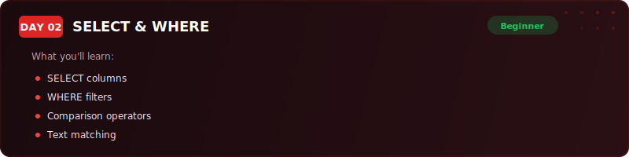
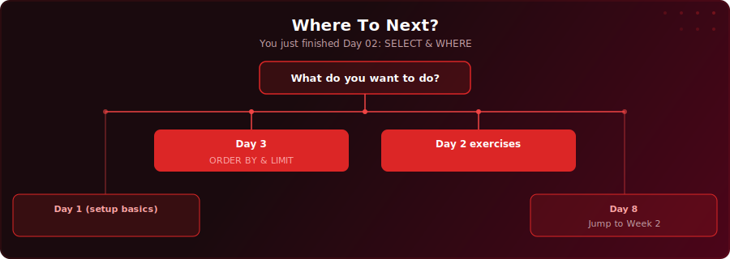

<p align="center">
  <a href="https://www.youtube.com/watch?v=-0uVBtXCZ_s"></a>
</p>

<p align="center">
  <a href="https://www.youtube.com/watch?v=-0uVBtXCZ_s"></a>
  
  
  
</p>

# Day 2 - SELECT & WHERE

[<< Day 1: Introduction to SQL & Databases](../day-01/) | [Day 3: ORDER BY & LIMIT >>](../day-03/)

---

## What You'll Learn

- How to pull data from a table using SELECT
- How to filter rows based on conditions using WHERE
- How to use comparison operators (=, <>, >, <, >=, <=)
- How to combine conditions with AND, OR, NOT, and parentheses
- How to handle NULL values with IS NULL

---

## Quick Setup

```sql
-- Run in pgAdmin (takes a few seconds)
\i setup.sql
```

Or open [`setup.sql`](setup.sql) and run the full script manually.

<details>
<summary>Verify your setup</summary>

```sql
-- Check your tables loaded correctly
SELECT COUNT(*) FROM your_table;
```

</details>

---

## Exercises

You're a data analyst at ClearPath Finance - a fintech startup that provides personal loans across the UK. The head of risk, Nia, sends you a message on Thursday morning. She's got a board meeting at 2pm and she needs answers fast. ClearPath is regulated by the Financial Conduct Authority, so if the risk team can't demonstrate proper oversight of high-risk applications, it affects the company's lending licence.

Using the `loan_applications` table, answer the questions below.

### 🟢 Warm-Up

**Q1:** Select just the `applicant_name`, `credit_score`, and `requested_amount` columns for all applications. Don't use `SELECT *` - pick only the three columns Nia needs.

**Q2:** Find all applications from London. How many are there?

### 🟡 Practice

**Q3:** Which applications have a credit score below 650 AND are requesting more than $50,000? These are the highest-risk candidates.

**Q4:** Which applications from London or Edinburgh were for Home Improvement and got approved? The board wants data to support expanding in those cities.

**Q5:** How many self-employed applicants are still pending review (i.e. have no decision yet)? Applications sitting without a decision is a compliance risk.

### 🔴 Challenge

**Q6:** Find all applications where the requested amount is more than double the applicant's annual income. These represent cases where the borrower is asking for significantly more than they earn in a year - a key risk indicator that Nia would want flagged separately.

**Q7:** Nia wants a single query that flags every pending application (no decision yet) where the credit score is below 600 OR the requested amount exceeds the applicant's annual income. These are the cases that need urgent review before the board meeting. How many are there?

### Solutions

Finished? Check your answers: [`solutions.sql`](solutions.sql)

---

## Key Concepts

- **SELECT:** Pulls data from a table - use `SELECT *` for exploring, specific columns for production queries

---

## Where To Next?

<p align="center">
  
</p>

---

<p align="center">
  <a href="../day-01/">&#9664; Day 1: Introduction to SQL & Databases</a> &nbsp;&nbsp;|&nbsp;&nbsp; <a href="../day-03/">Day 3: ORDER BY & LIMIT &#9654;</a>
</p>
