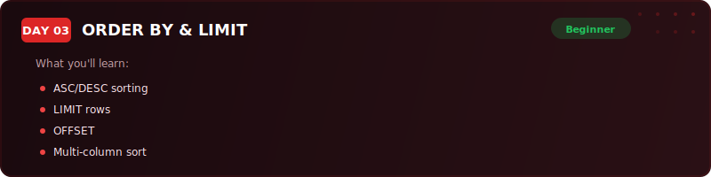
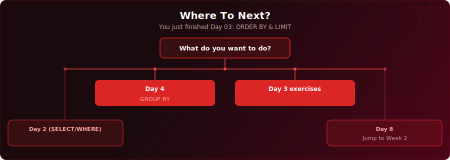

<p align="center">
  
</p>

<p align="center">
  <a href="https://www.youtube.com/watch?v=s86nI9dPZqY"></a>
  
  
  
</p>

# Day 3 - ORDER BY & LIMIT

[<< Day 2: SELECT & WHERE](../day-02/) | [Day 4: Aggregate Functions & GROUP BY >>](../day-04/)

---

## What You'll Learn

- How to sort results with ORDER BY (ascending and descending)
- How to limit rows returned with LIMIT and paginate with OFFSET
- How to find unique values with DISTINCT
- How to search for text patterns with LIKE, ILIKE, and wildcards
- How to filter against value lists with IN and ranges with BETWEEN

---

## Quick Setup

```sql
-- Run in pgAdmin (takes a few seconds)
\i setup.sql
```

Or open [`setup.sql`](setup.sql) and run the full script manually.

<details>
<summary>Verify your setup</summary>

```sql
-- Check your tables loaded correctly
SELECT COUNT(*) FROM your_table;
```

</details>

---

## Key Concepts

- **ORDER BY:** Sorts results - ASC (low to high, A to Z, oldest first) is the default; DESC reverses it

---

## Exercises

You're a sales analyst at ShopStream, a UK-based e-commerce company. The Head of Sales, Marcus, has sent you a message. He needs a quick analysis for tomorrow's regional review meeting. The board wants to understand Q1 2025 order patterns, and he's got questions he needs answered by end of day.

Using the `online_orders` table above, answer these questions:

### 🟢 Warm-Up

**Q1:** What are all the unique product categories ShopStream sells? List them in alphabetical order.

**Q2:** What are the top 10 highest-value orders? Show the customer name, product, amount, and region, sorted from highest to lowest.

### 🟡 Practice

**Q3:** Find all orders from London, North West, and West Midlands where the order amount is between $40 and $150. Sort by region, then by amount (highest first).

**Q4:** Which customers placed orders using a `@shopstream.com` email address? Show their names, emails, products, and amounts, sorted by amount (highest first).

**Q5:** Find all Sportswear orders from regions outside Scotland. Sort by amount (highest first).

### 🔴 Challenge

**Q6:** Find Gmail customers in London, Scotland, or Wales with order amounts between $30 and $300. Sort by region, then by amount (highest first), and show only the top 10.

**Q7:** Marcus also wants to know the second page of results for orders sorted by date (most recent first) - specifically rows 11 through 20. Write a query that returns this exact "page 2" of results using OFFSET and LIMIT.

### Solutions

Finished? Check your answers: [`solutions.sql`](solutions.sql)

---

## Key Concepts

- **ORDER BY:** Sorts results - ASC (low to high, A to Z, oldest first) is the default; DESC reverses it

---

## Where To Next?

<p align="center">
  
</p>

---

<p align="center">
  <a href="../day-02/">&#9664; Day 2: SELECT & WHERE</a> &nbsp;&nbsp;|&nbsp;&nbsp; <a href="../day-04/">Day 4: Aggregate Functions & GROUP BY &#9654;</a>
</p>
