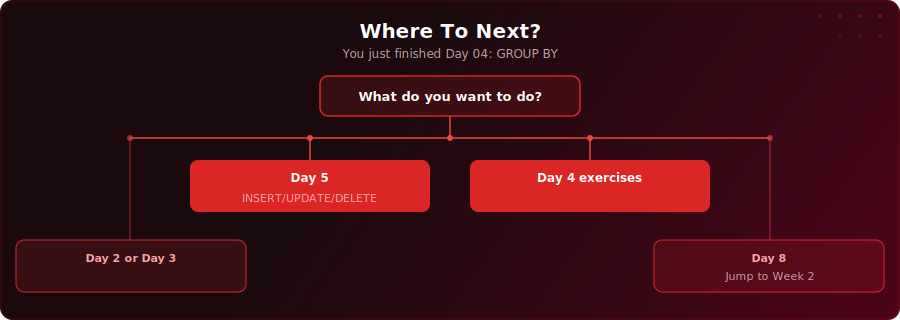

<p align="center">
  
</p>

<p align="center">
  <a href="https://www.youtube.com/watch?v=7IWrvTIrIkg"></a>
  
  
  
</p>

# Day 4 - Aggregate Functions & GROUP BY

[<< Day 3: ORDER BY & LIMIT](../day-03/) | [Day 5: INSERT, UPDATE & DELETE >>](../day-05/)

---

## What You'll Learn

- How to summarise data with the five core aggregate functions: COUNT, SUM, AVG, MIN, MAX
- How to count unique values with COUNT(DISTINCT)
- How to split data into categories with GROUP BY
- How to filter groups after aggregation with HAVING
- How SQL execution order works (FROM, WHERE, GROUP BY, HAVING, SELECT, ORDER BY, LIMIT)

---

## Quick Setup

```sql
-- Run in pgAdmin (takes a few seconds)
\i setup.sql
```

Or open [`setup.sql`](setup.sql) and run the full script manually.

<details>
<summary>Verify your setup</summary>

```sql
-- Check your tables loaded correctly
SELECT COUNT(*) FROM your_table;
```

</details>

---

## Key Concepts

- **COUNT(*):** Counts all rows including NULLs - use this when you want a row total

---

## Where To Next?

<p align="center">
  
</p>

---

<p align="center">
  <a href="../day-03/">&#9664; Day 3: ORDER BY & LIMIT</a> &nbsp;&nbsp;|&nbsp;&nbsp; <a href="../day-05/">Day 5: INSERT, UPDATE & DELETE &#9654;</a>
</p>
