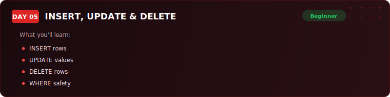
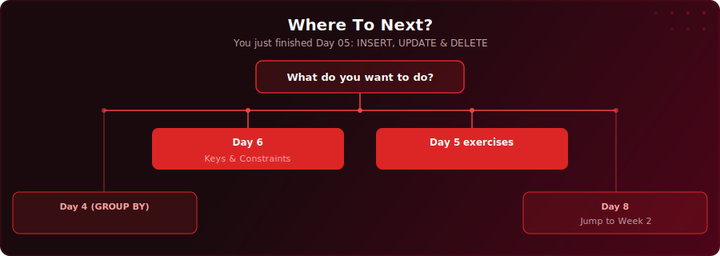

<p align="center">
  
</p>

<p align="center">
  <a href="https://www.youtube.com/watch?v=NJ4ujmOZt60"></a>
  
  
  
</p>

# Day 5 - INSERT, UPDATE & DELETE

[<< Day 4: Aggregate Functions & GROUP BY](../day-04/) | [Day 6: Primary & Foreign Keys >>](../day-06/)

---

## What You'll Learn

- How to add new rows to a table with INSERT (single-row and multi-row)
- How to modify existing rows with UPDATE (including calculated values and WHERE targeting)
- How to remove rows permanently with DELETE
- The difference between DELETE, TRUNCATE, and DROP
- The golden rule: always SELECT before UPDATE or DELETE

---

## Quick Setup

```sql
-- Run in pgAdmin (takes a few seconds)
\i setup.sql
```

Or open [`setup.sql`](setup.sql) and run the full script manually.

<details>
<summary>Verify your setup</summary>

```sql
-- Check your tables loaded correctly
SELECT COUNT(*) FROM your_table;
```

</details>

---

## Key Concepts

- **INSERT:** Adds new rows to a table - always list column names explicitly so your queries survive table structure changes

---

## Where To Next?

<p align="center">
  
</p>

---

<p align="center">
  <a href="../day-04/">&#9664; Day 4: Aggregate Functions & GROUP BY</a> &nbsp;&nbsp;|&nbsp;&nbsp; <a href="../day-06/">Day 6: Primary & Foreign Keys &#9654;</a>
</p>
