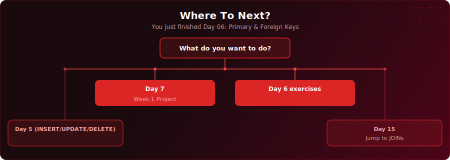

<p align="center">
  <a href="https://www.youtube.com/watch?v=1AdFU8Vdq-0"></a>
</p>

<p align="center">
  <a href="https://www.youtube.com/watch?v=1AdFU8Vdq-0"></a>
  
  
  
</p>

# Day 6 - Primary & Foreign Keys

[<< Day 5: INSERT, UPDATE & DELETE](../day-05/) | [Day 7: Project: Freight & Logistics Report >>](../day-07/)

---

## What You'll Learn

- How PRIMARY KEY uniquely identifies every row and prevents duplicates
- How FOREIGN KEY links tables together and prevents orphan records
- How NOT NULL, UNIQUE, CHECK, and DEFAULT enforce data quality rules
- Composite keys - primary keys made of multiple columns
- CASCADE, SET NULL, and RESTRICT - controlling what happens when referenced data changes

---

## Quick Setup

```sql
-- Run in pgAdmin (takes a few seconds)
\i setup.sql
```

Or open [`setup.sql`](setup.sql) and run the full script manually.

<details>
<summary>Verify your setup</summary>

```sql
-- Check your tables loaded correctly
SELECT COUNT(*) FROM your_table;
```

</details>

---

## Exercises

You are a data engineer at a UK-based fintech startup called **NovaPay**. They process payments for online merchants. The company is growing fast - 150 merchants, tens of thousands of transactions per month, and a team of 40 people.

The problem? The current database has no constraints. Tables were created quickly during the MVP phase, and now the data quality problems are piling up: duplicate merchant records causing double billing, transactions referencing merchants that were deleted months ago, negative transaction amounts in financial reports, and employees with no department assignment breaking the org chart dashboard.

The Head of Engineering has asked you to redesign the schema with proper constraints.

Using the concepts from today's lesson, complete these tasks:

### Warm-Up

**Q1:** Create a `novapay_merchants` table with: `merchant_id` as an auto-incrementing primary key, `merchant_name` (required, max 100 characters), `contact_email` (required and unique), `category` (must be one of 'retail', 'hospitality', 'saas', or 'marketplace'), `monthly_volume_limit` (must be greater than zero), `onboarded_date` (defaults to today), and `is_active` (defaults to TRUE).

**Q2:** Insert two valid merchants into your `novapay_merchants` table - one with category 'retail' and one with category 'saas'. Then SELECT all rows to confirm they were inserted correctly.

### Practice

**Q3:** Create a `novapay_transactions` table with a foreign key linking to merchants, a CHECK constraint ensuring the amount is greater than zero, currency restricted to 'GBP', 'EUR', or 'USD', status restricted to 'pending', 'completed', 'failed', or 'refunded', and ON DELETE CASCADE.

**Q4:** Create a `novapay_employees` table with CHECK constraints on department (must be 'engineering', 'operations', 'compliance', or 'sales'), role level (must be 'junior', 'mid', 'senior', 'lead', or 'head'), and salary (must be between 25,000 and 250,000). Include a required `start_date` with no default.

**Q5:** Test your constraints by attempting these inserts. Each one should fail - verify that the database rejects them and understand why:
- Insert a merchant with a duplicate email
- Insert a merchant with category 'crypto'
- Insert a transaction with a negative amount
- Insert a transaction referencing a non-existent merchant (merchant_id 999)

### Challenge

**Q6:** Delete a merchant that has transactions and verify that the CASCADE action automatically removes all their associated transactions. Count the transactions before and after the delete to prove it worked.

**Q7:** NovaPay's compliance team wants a single ALTER TABLE statement that adds a UNIQUE constraint on the combination of `merchant_id` and `currency` in the `novapay_transactions` table - so that each merchant can only have one pending transaction per currency at a time. Write the ALTER TABLE statement. Then test it by inserting two transactions with the same merchant and currency to confirm the constraint rejects the duplicate.

### Solutions

Finished? Check your answers: [`solutions.sql`](solutions.sql)

---

## Key Concepts

- **PRIMARY KEY**: Uniquely identifies every row - no duplicates, no NULLs, and SERIAL handles auto-incrementing

---

## Where To Next?

<p align="center">
  
</p>

---

<p align="center">
  <a href="../day-05/">&#9664; Day 5: INSERT, UPDATE & DELETE</a> &nbsp;&nbsp;|&nbsp;&nbsp; <a href="../day-07/">Day 7: Project: Freight & Logistics Report &#9654;</a>
</p>

---

<!-- CLIFFHANGER -->
<p align="center"><sub><b>UP NEXT</b></sub></p>
<p align="center"><a href="https://youtu.be/fiBYAziNtGI"></a></p>
<p align="center"><b>Day 7 &nbsp;&middot;&nbsp; Project: Freight & Logistics Report</b></p>
<p align="center"><i>The day you stop learning and start building.</i></p>
<!-- /CLIFFHANGER -->
