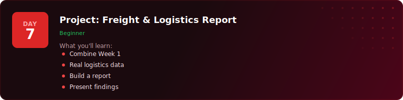
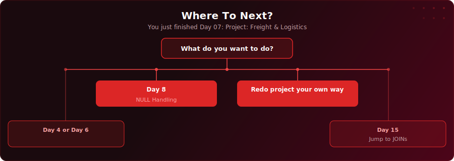

<p align="center">
  <a href="https://youtu.be/fiBYAziNtGI"></a>
</p>

<p align="center">
  <a href="https://youtu.be/fiBYAziNtGI"></a>
  
  
  
</p>

# Day 7 - Project: Freight & Logistics Report

[<< Day 6: Primary & Foreign Keys](../day-06/) | [Day 8: NULL Handling >>](../day-08/)

---

## What You'll Learn

- How to explore, clean, and analyse a real multi-table dataset end-to-end
- How to detect and fix mislabelled records using UPDATE with WHERE conditions
- How to find and remove duplicate entries using GROUP BY + HAVING
- How to build an executive summary with aggregated performance metrics

---

## Quick Setup

```sql
-- Run in pgAdmin (takes a few seconds)
\i setup.sql
```

Or open [`setup.sql`](setup.sql) and run the full script manually.

<details>
<summary>Verify your setup</summary>

```sql
-- Check your tables loaded correctly
SELECT COUNT(*) FROM your_table;
```

</details>

---

---

<p align="center">
  <a href="https://www.youtube.com/@sdw-online?sub_confirmation=1"></a>
</p>

## Exercises

You are a data analyst at **Orion Freight**, a UK-based logistics company with six regional depots. Your operations director has a board meeting next week. He is presenting Q1 2025 performance - January through March - and he needs answers. But the warehouse team has warned that there are dodgy records in the system: shipments marked as delivered with no delivery date, shipments marked as in transit that have already been delivered, and duplicate entries from a system migration in February.

This is how real data projects work. You explore first, clean second, analyse third. Complete the following steps to build the board report:

### Step 1 - Explore the Raw Data

Query all four tables to understand what you are working with. How many depots are there? What vehicle types exist? How many shipments are in each status? Get a feel for the data before changing anything.

### Step 2 - Find the Mislabelled "Delivered" Records

Find all shipments where the status is 'delivered' but delivery_date is NULL. These have been mislabelled. There should be 4 of them (shipments 9, 33, 51, 73) - look for the notes that say "status needs review".

### Step 3 - Fix the Mislabelled "Delivered" Records

Update those 4 records: change their status from 'delivered' to 'pending' since we do not know when they were actually delivered. Always SELECT before UPDATE to preview what will change.

### Step 4 - Find the Mislabelled "In Transit" Records

Find all shipments where the status is 'in_transit' but delivery_date IS NOT NULL. These have actually been delivered. There should be 3 of them (shipments 12, 37, 57) - look for the notes that say "actually delivered".

### Step 5 - Fix the Mislabelled "In Transit" Records

Update those 3 records: change their status from 'in_transit' to 'delivered'. Again, SELECT first to preview.

### Step 6 - Find the Duplicate Tracking Codes

Use GROUP BY on tracking_code with HAVING COUNT(*) > 1 to find duplicate tracking codes. There should be 5 duplicated codes. Examine them to confirm they are genuine copies from the system migration.

### Step 7 - Remove the Duplicates

Delete the duplicate rows (the ones with the higher shipment_id - these are the migration copies, shipments 116-120). After deletion, the shipment count should drop from 120 to 115.

### Step 8 - Build the Executive Summary

Now that the data is clean, build the board report. Calculate total shipments by status, shipments per depot, total revenue by region, and the overall delivery rate. These are the numbers the operations director takes to the board.

### Solutions

Finished? Check your answers: [`solutions.sql`](solutions.sql)

---

## Key Concepts

- **Explore first, clean second, analyse third**: The standard workflow for any real data project

---

## Where To Next?

<p align="center">
  
</p>

---

<p align="center">
  <a href="../day-06/">&#9664; Day 6: Primary & Foreign Keys</a> &nbsp;&nbsp;|&nbsp;&nbsp; <a href="../day-08/">Day 8: NULL Handling &#9654;</a>
</p>
