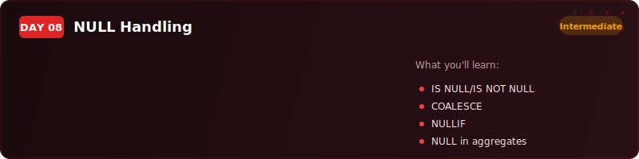
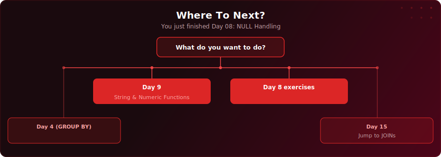

<p align="center">
  
</p>

<p align="center">
  <a href="https://www.youtube.com/watch?v=0nH464EoZ9w"></a>
  
  
  
</p>

# Day 8 - NULL Handling

[<< Day 7: Project: Freight & Logistics Report](../day-07/) | [Day 9: String & Numeric Functions >>](../day-09/)

---

## What You'll Learn

- What NULL actually means in SQL and why it causes silent bugs
- Three-valued logic - how TRUE, FALSE, and UNKNOWN work
- IS NULL and IS NOT NULL - the only correct way to check for missing values
- COALESCE - replacing NULLs with fallback values in reports and calculations
- NULLIF - preventing division-by-zero errors and cleaning placeholder values
- How NULL behaves in aggregate functions and sorting

---

## Quick Setup

```sql
-- Run in pgAdmin (takes a few seconds)
\i setup.sql
```

Or open [`setup.sql`](setup.sql) and run the full script manually.

<details>
<summary>Verify your setup</summary>

```sql
-- Check your tables loaded correctly
SELECT COUNT(*) FROM your_table;
```

</details>

---

## Key Concepts

- **NULL means unknown:** It is not zero, not an empty string - it is the complete absence of a value

---

## Where To Next?

<p align="center">
  
</p>

---

<p align="center">
  <a href="../day-07/">&#9664; Day 7: Project: Freight & Logistics Report</a> &nbsp;&nbsp;|&nbsp;&nbsp; <a href="../day-09/">Day 9: String & Numeric Functions &#9654;</a>
</p>
