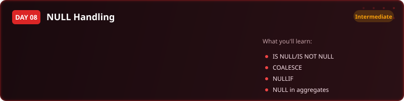
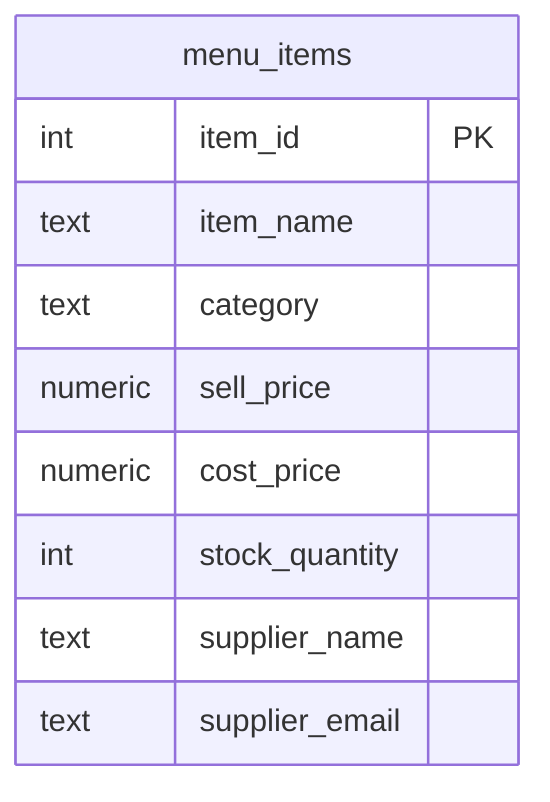

  

  
  
  
  
  

<h1 align="center">Day 8 &middot; Exercise Questions</h1>

  <a href="README.md">&#8592; Back to Day 8</a> &nbsp;&middot;&nbsp;
  <a href="exercise.sql">Exercise tables</a> &nbsp;&middot;&nbsp;
  <a href="solutions.sql">Solutions</a>

---

> [!NOTE]
> **How to use this page.** Run [`exercise.sql`](exercise.sql) first to create the tables and load the
> data, then answer the questions below **without opening the solutions**. Each one tells you what to
> return, and hides the expected result behind a toggle so you can check yourself once you have tried.
>
> The technique is deliberately not named. Working out which tool the question needs is most of the skill.

### Your run

- [ ] [1. Audit what is actually missing](#q1)
- [ ] [2. A price list that reads properly](#q2)
- [ ] [3. Items nobody has categorised](#q3)
- [ ] [4. Low stock and nobody to call](#q4)

---

## The scenario

You are a data analyst at Bean and Leaf, a coffee shop chain. The menu system has been filled in by different people over time, so plenty of fields were simply left empty. Kwame, the operations manager, needs an audit before the monthly supplier review.

| Table | One row is |
|---|---|
| `menu_items` | one item on the menu, with its prices, supplier, category and stock |

> [!IMPORTANT]
> Before you start: an empty field is not a zero, and it is not equal to anything - including another empty field. Almost every question below turns on that.

---

### 1. Audit what is actually missing

Kwame wants one row telling him how many items are missing a cost price, how many are missing a supplier, and how many have no category.

**Return:** three counts, one per field, on a single row.

<b>Check yourself</b>

 

`COUNT(*)` and `COUNT(column)` do not return the same number. The gap between them is your answer.

---

### 2. A price list that reads properly

Print the menu with its selling price and cost price, but where no cost has been recorded the report must say so in words rather than showing a manager a blank cell.

**Return:** item name, sell price, cost price, and a display column that falls back to a readable message.

<b>Check yourself</b>

 

Every row in the table must appear. If your row count dropped, you filtered instead of substituting.

---

### 3. Items nobody has categorised

The menu is being reorganised and anything without a category needs assigning.

**Return:** item name, sell price, stock quantity.

<b>Check yourself</b>

 

If you compared the category to an empty value with =, you will get nothing back. That is the lesson, not a bug.

---

### 4. Low stock and nobody to call

This is the one that gets escalated: items running low that also have no supplier recorded to reorder from. Fewer than 20 in stock, and no supplier.

**Return:** item name, stock quantity, sell price.

<b>Check yourself</b>

 

Two conditions, and one of them is about absence rather than a value.

---

## When you are done

Compare against [`solutions.sql`](solutions.sql). If your query returns the right rows by a different
route, that is not a mistake - there is usually more than one correct answer.

> [!TIP]
> What matters is whether you can say **why you chose yours**, what it costs, and what would have to be
> true about the data for it to break. That question, not the syntax, is the one interviews are
> actually testing.

  <a href="../day-07/">&#8592; Day 7</a> &nbsp;&middot;&nbsp;
  <a href="README.md">Back to Day 8</a> &nbsp;&middot;&nbsp;
  <a href="../day-09/">Day 9 &#8594;</a>

