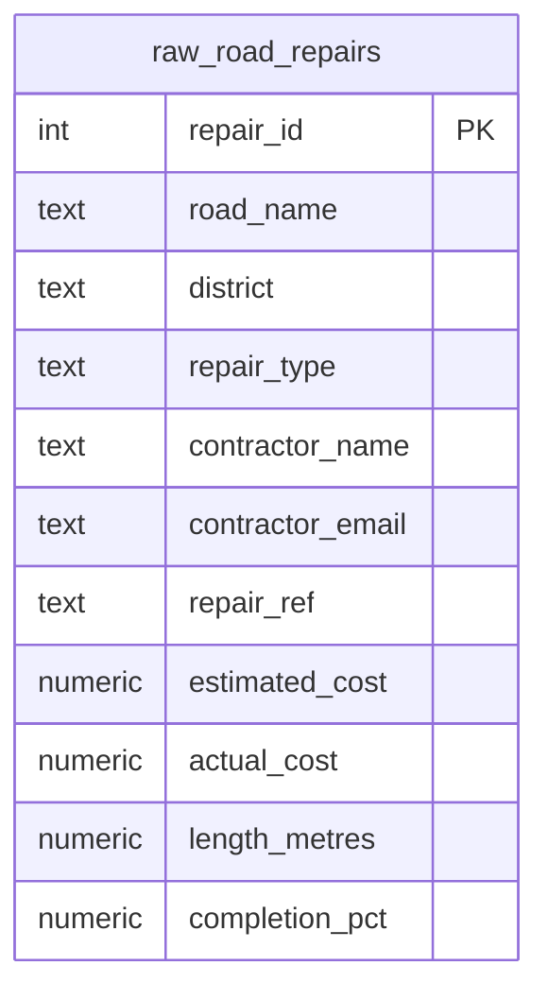

  

  
  
  
  
  

<h1 align="center">Day 9 &middot; Exercise Questions</h1>

  <a href="README.md">&#8592; Back to Day 9</a> &nbsp;&middot;&nbsp;
  <a href="exercise.sql">Exercise tables</a> &nbsp;&middot;&nbsp;
  <a href="solutions.sql">Solutions</a>

---

> [!NOTE]
> **How to use this page.** Run [`exercise.sql`](exercise.sql) first to create the tables and load the
> data, then answer the questions below **without opening the solutions**. Each one tells you what to
> return, and hides the expected result behind a toggle so you can check yourself once you have tried.
>
> The technique is deliberately not named. Working out which tool the question needs is most of the skill.

### Your run

- [ ] [1. Find the invisible mess](#q1)
- [ ] [2. Make the text presentable](#q2)
- [ ] [3. Where the money went over](#q3)
- [ ] [4. The city code hidden in the reference](#q4)

---

## The scenario

You are supporting a city council infrastructure team. Road repair records imported from four district offices are inconsistent - stray spaces, mixed capitalisation, and reference codes with meaning buried inside them - and cannot be used for reporting until they are cleaned.

| Table | One row is |
|---|---|
| `raw_road_repairs` | one repair job, with its reference, road, district, type and costs |

> [!IMPORTANT]
> The data is not wrong, it is untidy. Your job is to make it comparable without changing what is stored.

---

### 1. Find the invisible mess

Before cleaning anything, prove which rows actually have a spacing problem. Show the road name and district with their lengths before and after the stray spaces come off, and return only the rows where those differ.

**Return:** repair id, road name, its raw and trimmed length, district, its raw and trimmed length.

<b>Check yourself</b>

 

If a row appears here, the two lengths in it must not match. That is the entire filter.

---

### 2. Make the text presentable

Produce a clean version for a public-facing report: road names in title case, districts in capitals, repair type tidied.

**Return:** repair ref, cleaned road name, cleaned district, cleaned repair type.

<b>Check yourself</b>

 

Trim before you change case, or you will capitalise a space.

---

### 3. Where the money went over

Finance wants the difference between what each job was estimated at and what it actually cost, in pounds and as a percentage, both to two decimal places.

**Return:** repair ref, road name, cost variance, variance percentage.

<b>Check yourself</b>

 

A negative variance means it came in under. Do not take an absolute value - the sign is the information.

---

### 4. The city code hidden in the reference

Each repair reference carries a three-character city code inside it, starting at the fourth character. Pull it into its own column so jobs can be grouped by city.

**Return:** repair ref, city code, road name.

<b>Check yourself</b>

 

Count the characters carefully. Off by one here is silent and wrong.

---

## When you are done

Compare against [`solutions.sql`](solutions.sql). If your query returns the right rows by a different
route, that is not a mistake - there is usually more than one correct answer.

> [!TIP]
> What matters is whether you can say **why you chose yours**, what it costs, and what would have to be
> true about the data for it to break. That question, not the syntax, is the one interviews are
> actually testing.

  <a href="../day-08/">&#8592; Day 8</a> &nbsp;&middot;&nbsp;
  <a href="README.md">Back to Day 9</a> &nbsp;&middot;&nbsp;
  <a href="../day-10/">Day 10 &#8594;</a>

