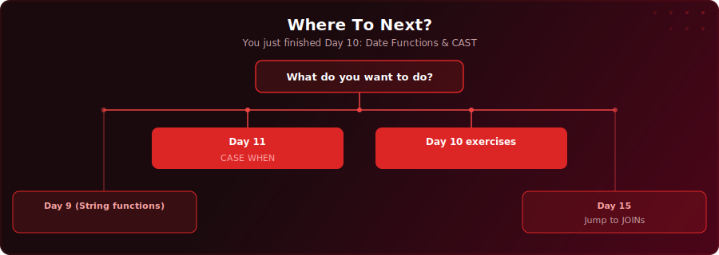

<p align="center">
  <a href="https://youtu.be/Iturx2kgs1A"></a>
</p>

<p align="center">
  <a href="https://youtu.be/Iturx2kgs1A"></a>
  
  
  
</p>

# Day 10 - Date Functions & CAST

[<< Day 9: String & Numeric Functions](../day-09/) | [Day 11: CASE WHEN >>](../day-11/)

---

## What You'll Learn

- AGE() - calculating durations between two dates or from a date to today
- EXTRACT() - pulling out specific parts of a date (year, month, day, quarter)
- DATE_TRUNC() - rounding dates down to a period for grouping by month or quarter
- TO_CHAR() - formatting dates as readable strings for reports
- CURRENT_DATE - getting today's date dynamically
- Date arithmetic - adding and subtracting intervals from dates
- CAST - converting between data types (text to date, numeric to integer)

---

## Quick Setup

```sql
-- Run in pgAdmin (takes a few seconds)
\i setup.sql
```

Or open [`setup.sql`](setup.sql) and run the full script manually.

<details>
<summary>Verify your setup</summary>

```sql
-- Check your tables loaded correctly
SELECT COUNT(*) FROM your_table;
```

</details>

---

---

<p align="center">
  <a href="https://www.youtube.com/@sdw-online?sub_confirmation=1"></a>
</p>

## Exercises

You are a data analyst at a health organisation. The operations lead needs a board report on referral-to-appointment wait times before the quarterly review.

Using the `patient_referrals` table, complete the tasks below.

### Task 1: Calculate AGE Since Referral

For each patient, calculate how long ago they were referred using AGE(). Show the patient name, department, referral date, and the calculated age since referral. Include patients still waiting (no appointment yet).

### Task 2: Patients Waiting 90 or More Days

Find all patients who waited 90 or more days between referral and appointment, or who have been waiting 90+ days with no appointment yet. Use date arithmetic. Show patient name, department, urgency, referral date, appointment date, and the wait in days.

### Task 3: Referrals Per Month

Count the number of referrals per month using DATE_TRUNC. Show the month (formatted with TO_CHAR as 'Mon YYYY'), and the referral count. Sort chronologically.

### Task 4: Group by Quarter

Using EXTRACT, group referrals by year and quarter. Show the year, quarter number, and count of referrals. Sort by year and quarter.

### Task 5: Format Dates for the Report

Produce a clean summary showing patient name, department, referral date formatted as 'DD Mon YYYY', appointment date formatted the same way (or 'Awaiting appointment' for NULLs), and urgency. Use TO_CHAR and COALESCE.

### Task 6: Full Combined Report

Combine the above into a single triage report. For each patient, show name, department, urgency, days waited (or days waiting so far for those still pending), and a status column: 'Seen' if appointment_date IS NOT NULL, or 'Waiting' otherwise. Sort by days waited descending.

### Solutions

Finished? Check your answers: [`solutions.sql`](solutions.sql)

---

## Key Concepts

- **AGE():** Calculates a human-readable interval between two dates - ideal for age and duration reporting

---

## Where To Next?

<p align="center">
  
</p>

---

<p align="center">
  <a href="../day-09/">&#9664; Day 9: String & Numeric Functions</a> &nbsp;&nbsp;|&nbsp;&nbsp; <a href="../day-11/">Day 11: CASE WHEN &#9654;</a>
</p>

---

<!-- CLIFFHANGER -->
<p align="center"><sub><b>UP NEXT</b></sub></p>
<p align="center"><a href="https://youtu.be/eZ5iTTsKGkI"></a></p>
<p align="center"><b>Day 11 &nbsp;&middot;&nbsp; CASE WHEN</b></p>
<p align="center"><i>Most people overuse CASE WHEN. There is a cleaner way.</i></p>
<!-- /CLIFFHANGER -->
