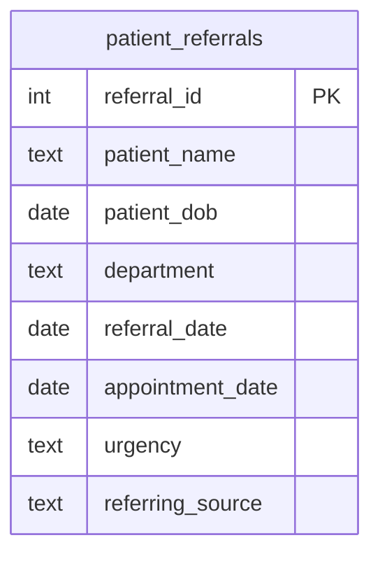

  

  
  
  
  
  

<h1 align="center">Day 10 &middot; Exercise Questions</h1>

  <a href="README.md">&#8592; Back to Day 10</a> &nbsp;&middot;&nbsp;
  <a href="exercise.sql">Exercise tables</a> &nbsp;&middot;&nbsp;
  <a href="solutions.sql">Solutions</a>

---

> [!NOTE]
> **How to use this page.** Run [`exercise.sql`](exercise.sql) first to create the tables and load the
> data, then answer the questions below **without opening the solutions**. Each one tells you what to
> return, and hides the expected result behind a toggle so you can check yourself once you have tried.
>
> The technique is deliberately not named. Working out which tool the question needs is most of the skill.

### Your run

- [ ] [1. How long ago was each referral](#q1)
- [ ] [2. Patients waiting 90 days or more](#q2)
- [ ] [3. Referrals per month](#q3)
- [ ] [4. Referrals per quarter](#q4)
- [ ] [5. A report a human can read](#q5)
- [ ] [6. The full triage view](#q6)

---

## The scenario

You are a data analyst at a health organisation. The operations lead needs a board report on referral-to-appointment wait times before the quarterly review. Some patients have been seen; some are still waiting.

| Table | One row is |
|---|---|
| `patient_referrals` | one referral, with patient, department, urgency, referral date and appointment date if one exists |

> [!IMPORTANT]
> A missing appointment date does not mean nothing happened - it means the patient is still waiting. Several questions below depend on treating it that way rather than dropping the row.

---

### 1. How long ago was each referral

Show every referral with a readable elapsed time since it was made - years, months and days rather than a raw number.

**Return:** patient name, department, referral date, time since referral.

<b>Check yourself</b>

 

This should return every row in the table.

---

### 2. Patients waiting 90 days or more

The waiting list review needs everyone whose wait has reached 90 days. A patient who has been seen waited until their appointment; a patient still waiting has waited until today.

**Return:** patient name, department, urgency, referral date, appointment date, days waited.

<b>Check yourself</b>

 

If your query silently drops the patients with no appointment, you have excluded the people the report exists for.

---

### 3. Referrals per month

Show how many referrals came in each month, labelled readably, oldest month first.

**Return:** month, referral count.

<b>Check yourself</b>

 

Group by the actual month value, not by the formatted label, or your ordering will go alphabetical.

---

### 4. Referrals per quarter

The same count, but by year and quarter, for the board pack.

**Return:** year, quarter, referral count.

<b>Check yourself</b>

 

Four quarters per year, in order.

---

### 5. A report a human can read

Format the dates as day, short month and year. Where no appointment exists, say so in words.

**Return:** patient name, department, formatted referral date, formatted appointment date or a message, urgency.

<b>Check yourself</b>

 

No raw timestamps and no blank cells in the output.

---

### 6. The full triage view

Bring it together: how long each patient has waited, and whether they have been seen or are still waiting, longest wait first.

**Return:** patient name, department, urgency, days waited, status.

<b>Check yourself</b>

 

The top of this list is the report's whole purpose. If the longest waits are not at the top, check your ordering.

---

## When you are done

Compare against [`solutions.sql`](solutions.sql). If your query returns the right rows by a different
route, that is not a mistake - there is usually more than one correct answer.

> [!TIP]
> What matters is whether you can say **why you chose yours**, what it costs, and what would have to be
> true about the data for it to break. That question, not the syntax, is the one interviews are
> actually testing.

  <a href="../day-09/">&#8592; Day 9</a> &nbsp;&middot;&nbsp;
  <a href="README.md">Back to Day 10</a> &nbsp;&middot;&nbsp;
  <a href="../day-11/">Day 11 &#8594;</a>

