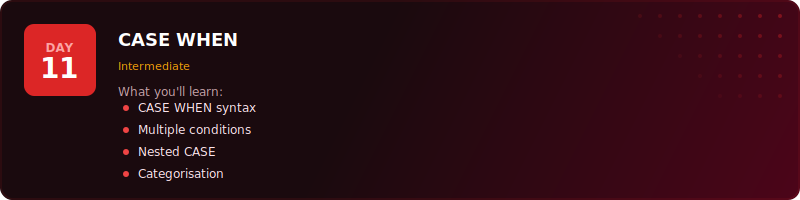
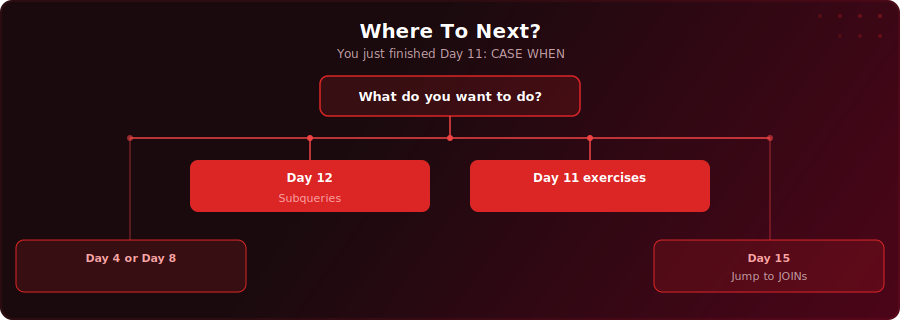

<p align="center">
  
</p>

<p align="center">
  <a href="https://youtu.be/eZ5iTTsKGkI"></a>
  
  
  
</p>

# Day 11 - CASE WHEN

[<< Day 10: Date Functions & CAST](../day-10/) | [Day 12: Subqueries & Temp Tables >>](../day-12/)

---

## What You'll Learn

- Simple CASE - matching a single column against fixed values to produce labels
- Searched CASE WHEN - evaluating flexible conditions with full boolean expressions
- CASE WHEN in SELECT - adding classification columns to any query
- CASE WHEN in aggregates - counting or summing only rows that match a condition
- Nested CASE - building multi-level decision logic
- How ELSE and NULL interact when no condition is matched

---

## Quick Setup

```sql
-- Run in pgAdmin (takes a few seconds)
\i setup.sql
```

Or open [`setup.sql`](setup.sql) and run the full script manually.

<details>
<summary>Verify your setup</summary>

```sql
-- Check your tables loaded correctly
SELECT COUNT(*) FROM your_table;
```

</details>

---

## Key Concepts

- **Simple CASE:** Matches a single column against a list of values - cleaner than multiple OR conditions

---

## Exercises

You are a data analyst at an insurance company. The operations manager, **Ingrid**, needs a triage report to help the claims team prioritise their workload.

Using the `insurance_claims` table, complete the tasks below.

### Task 1: Classify by Priority

Add a priority classification to each claim. Use CASE WHEN to label each claim as:
- 'High' if claim_amount >= 10000
- 'Medium' if claim_amount >= 2500
- 'Low' for everything else

Show claim_id, claimant_name, incident_type, claim_amount, and the priority label.

### Task 2: Label Incident Types

The incident_type column contains short codes. Use a simple CASE to produce a readable label:
- 'auto' -> 'Motor Vehicle'
- 'home' -> 'Property'
- 'health' -> 'Medical'
- 'travel' -> 'Travel'
- 'liability' -> 'Liability'

Show claim_id, claimant_name, the original incident_type, and the readable label.

### Task 3: Flag SLA Breaches

The target response time is 48 hours. Use CASE WHEN to flag each claim:
- 'Breached' if response_hours > 48
- 'Within SLA' if response_hours <= 48
- 'Not recorded' if response_hours IS NULL

Show claim_id, claimant_name, response_hours, and the SLA status.

### Task 4: Count by Priority

Using CASE WHEN inside COUNT, produce a single summary row showing how many claims fall into each priority band: High, Medium, and Low.

### Task 5: Full Triage Report

Combine Tasks 1, 2, and 3 into a single query. Show claim_id, claimant_name, the readable incident type, claim_amount, priority, and SLA status. Sort by priority (High first, then Medium, then Low), and within each group by claim_amount descending.

### Solutions

Finished? Check your answers: [`solutions.sql`](solutions.sql)

---

## Key Concepts

- **Simple CASE:** Matches a single column against a list of values - cleaner than multiple OR conditions

---

## Where To Next?

<p align="center">
  
</p>

---

<p align="center">
  <a href="../day-10/">&#9664; Day 10: Date Functions & CAST</a> &nbsp;&nbsp;|&nbsp;&nbsp; <a href="../day-12/">Day 12: Subqueries & Temp Tables &#9654;</a>
</p>
