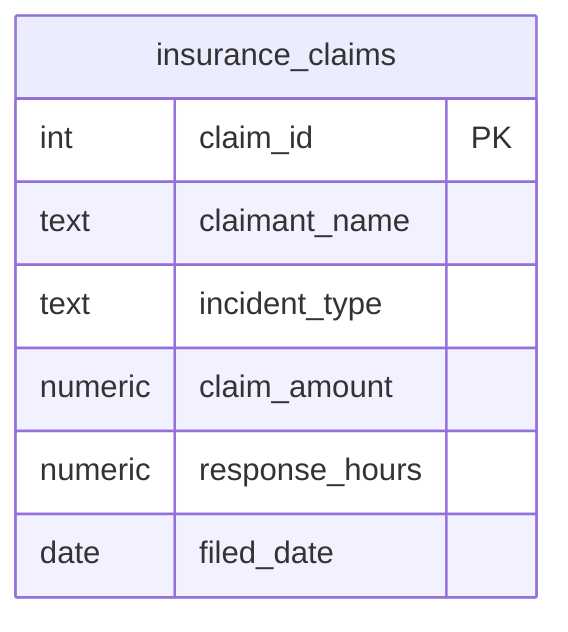

  

  
  
  
  
  

<h1 align="center">Day 11 &middot; Exercise Questions</h1>

  <a href="README.md">&#8592; Back to Day 11</a> &nbsp;&middot;&nbsp;
  <a href="exercise.sql">Exercise tables</a> &nbsp;&middot;&nbsp;
  <a href="solutions.sql">Solutions</a>

---

> [!NOTE]
> **How to use this page.** Run [`exercise.sql`](exercise.sql) first to create the tables and load the
> data, then answer the questions below **without opening the solutions**. Each one tells you what to
> return, and hides the expected result behind a toggle so you can check yourself once you have tried.
>
> The technique is deliberately not named. Working out which tool the question needs is most of the skill.

### Your run

- [ ] [1. Band the claims by priority](#q1)
- [ ] [2. Turn codes into labels](#q2)
- [ ] [3. Flag the service breaches](#q3)
- [ ] [4. Count the bands on one row](#q4)
- [ ] [5. The full triage report](#q5)

---

## The scenario

You are a data analyst at an insurance company. Ingrid, the operations manager, needs a triage report to help the claims team prioritise their workload.

| Table | One row is |
|---|---|
| `insurance_claims` | one claim, with the claimant, incident type, amount and response time |

> [!IMPORTANT]
> Every question here turns a raw value into a business label. Watch what happens to rows that match none of your conditions.

---

### 1. Band the claims by priority

Anything from 10,000 upwards is High, from 2,500 up to 10,000 is Medium, everything else is Low.

**Return:** claim id, claimant name, incident type, claim amount, priority.

<b>Check yourself</b>

 

Every row must come back with a priority. A blank means a value fell through every branch.

---

### 2. Turn codes into labels

The incident types are stored as short codes. Produce the customer-facing labels: auto is Motor Vehicle, home is Property, health is Medical, travel is Travel, liability is Liability.

**Return:** claim id, claimant name, incident type, incident label.

<b>Check yourself</b>

 

If a code appears that you did not list, what does your query return for it? Decide that deliberately.

---

### 3. Flag the service breaches

Anything answered in over 48 hours has breached the service level, anything within 48 hours has not, and some claims have no response time recorded at all - those must not be reported as either.

**Return:** claim id, claimant name, response hours, SLA status.

<b>Check yourself</b>

 

Three possible outcomes, not two. The third is the one people forget.

---

### 4. Count the bands on one row

Ingrid wants the three priority counts side by side on a single row, not as three separate rows.

**Return:** high count, medium count, low count.

<b>Check yourself</b>

 

The three counts must add up to the total number of claims.

---

### 5. The full triage report

Combine it: claim, claimant, the readable incident label, the amount, and its priority band.

**Return:** claim id, claimant name, incident label, claim amount, priority.

<b>Check yourself</b>

 

This is what a claims handler would actually open. If any column still shows a raw code, it is not finished.

---

## When you are done

Compare against [`solutions.sql`](solutions.sql). If your query returns the right rows by a different
route, that is not a mistake - there is usually more than one correct answer.

> [!TIP]
> What matters is whether you can say **why you chose yours**, what it costs, and what would have to be
> true about the data for it to break. That question, not the syntax, is the one interviews are
> actually testing.

  <a href="../day-10/">&#8592; Day 10</a> &nbsp;&middot;&nbsp;
  <a href="README.md">Back to Day 11</a> &nbsp;&middot;&nbsp;
  <a href="../day-12/">Day 12 &#8594;</a>

