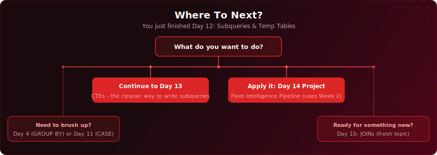

<p align="center">
  <a href="https://youtu.be/SOt5jUrzKOU"></a>
</p>

<p align="center">
  <a href="https://youtu.be/SOt5jUrzKOU"></a>
  
  
  
</p>

# Day 12 - Subqueries & Temp Tables

[<< Day 11: CASE WHEN](../day-11/) | [Day 13: CTEs (Part 1) >>](../day-13/)

---

## What You'll Learn

- How to nest one query inside another to answer multi-step questions
- Subquery patterns in WHERE: comparison operators and IN
- Scalar subqueries in SELECT for adding calculated benchmark columns
- Correlated subqueries that reference the outer query row by row
- Derived tables in FROM for multi-step calculations
- Temporary tables for storing intermediate results you need to reuse

---

## Quick Setup

```sql
-- Run in pgAdmin (takes a few seconds)
\i setup.sql
```

Or open [`setup.sql`](setup.sql) and run the full script manually.

<details>
<summary>Verify your setup</summary>

```sql
-- Check your tables loaded correctly
SELECT COUNT(*) FROM your_table;
```

</details>

---

## Exercises

You work at a regional education authority. The Head of School Performance needs a benchmarking report that compares student scores against school and national averages.

Using the `school_results` table, complete the tasks below.

### Task 1: Above-Average Students

Use a subquery to find all students who scored above the overall average score. Show the student name, school, subject, and score, sorted by score descending.

### Task 2: School Average vs Student Score

Use a correlated subquery in SELECT to show each student's score alongside their school's average score. Add a column showing the difference between the student's score and their school average. Sort by school name, then score descending.

### Task 3: Underperforming Schools

Use a derived table (subquery in FROM) to find schools whose average score is below the national average. Show the school name and average score.

### Task 4: Temp Table Report

Create a temp table that stores each school's average score, student count, and highest score. Then query the temp table to produce a summary report, adding a performance rating: "Strong" for averages above 80, "Average" for 60+, and "Needs Support" for below 60.

### Solutions

Finished? Check your answers: [`solutions.sql`](solutions.sql)

---

## Key Concepts

- **Subqueries in WHERE:** Use a subquery as a dynamic threshold instead of hardcoding values

---

## Where To Next?

<p align="center">
  
</p>

---

<p align="center">
  <a href="../day-11/">&#9664; Day 11: CASE WHEN</a> &nbsp;&nbsp;|&nbsp;&nbsp; <a href="../day-13/">Day 13: CTEs (Part 1) &#9654;</a>
</p>

---

<!-- CLIFFHANGER -->
<p align="center"><sub><b>UP NEXT</b></sub></p>
<p align="center"><a href="https://youtu.be/IijQJAfqcJc"></a></p>
<p align="center"><b>Day 13 &nbsp;&middot;&nbsp; CTEs (Part 1)</b></p>
<p align="center"><i>CTEs are why your seniors read SQL faster than you. Yet.</i></p>
<!-- /CLIFFHANGER -->
