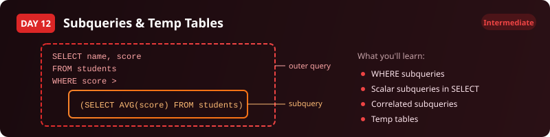

  

  
  
  
  

# Day 12 - Exercise Questions

[<< Back to Day 12](README.md) | [Exercise tables](exercise.sql) | [Solutions](solutions.sql)

---

**How to use this page.** Run [exercise.sql](exercise.sql) first to create the tables and load the
data. Then answer the questions below **without opening the solutions**. Each one tells you what to
return and gives you a way to check yourself. The technique is deliberately not named - working out
which tool the question needs is most of the skill.

Stuck? The video walks through every one of these.

---

## The scenario

You work at a regional education authority. The Head of School Performance needs a benchmarking report comparing student scores against school and overall averages.

| Table | One row is |
|---|---|
| `school_results` | one student's score in one subject at one school |

**Several of these need a number worked out from the same table you are querying. That is the point of the day.**

---

## Question 1 - Who is above the overall average

List every result that beat the average score across all schools and all subjects, best first.

**Return:** student name, school name, subject, score.

> **Check yourself:** The average is a single number computed over the whole table, not per school.

---

## Question 2 - Each student against their own school

Now compare each student to their own school's average, and show the gap.

**Return:** student name, school name, subject, score, school average, difference from that average.

> **Check yourself:** The average has to change per row depending on the school. If every row shows the same average, it is not tied to the school.

---

## Question 3 - Schools below the overall picture

Which schools have an average below the overall average across all schools?

**Return:** school name, average score to one decimal place.

> **Check yourself:** You need the per-school averages to exist before you can compare them to anything.

---

## Question 4 - A reusable summary

Build a summary the rest of the analysis can query repeatedly without recomputing it - average score, number of students and highest score per school - then select from it.

**Return:** school name, average score, student count, highest score.

> **Check yourself:** One row per school. More than that and your grouping is wrong.

---

## When you are done

Compare against [solutions.sql](solutions.sql). If your query returns the right rows by a different
route, that is not a mistake - there is usually more than one correct answer. What matters is
whether you can say **why you chose yours**, what it costs, and what would have to be true about the
data for it to break.

That question - not the syntax - is the one interviews are actually testing.

---

[<< Day 11](../day-11/) | [Back to Day 12](README.md) | [Day 13 >>](../day-13/)
