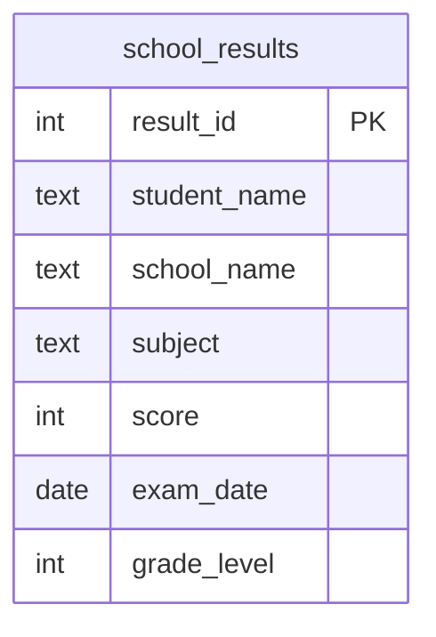

  

  
  
  
  
  

<h1 align="center">Day 12 &middot; Exercise Questions</h1>

  <a href="README.md">&#8592; Back to Day 12</a> &nbsp;&middot;&nbsp;
  <a href="exercise.sql">Exercise tables</a> &nbsp;&middot;&nbsp;
  <a href="solutions.sql">Solutions</a>

---

> [!NOTE]
> **How to use this page.** Run [`exercise.sql`](exercise.sql) first to create the tables and load the
> data, then answer the questions below **without opening the solutions**. Each one tells you what to
> return, and hides the expected result behind a toggle so you can check yourself once you have tried.
>
> The technique is deliberately not named. Working out which tool the question needs is most of the skill.

### Your run

- [ ] [1. Who is above the overall average](#q1)
- [ ] [2. Each student against their own school](#q2)
- [ ] [3. Schools below the overall picture](#q3)
- [ ] [4. A reusable summary](#q4)

---

## The scenario

You work at a regional education authority. The Head of School Performance needs a benchmarking report comparing student scores against school and overall averages.

| Table | One row is |
|---|---|
| `school_results` | one student's score in one subject at one school |

> [!IMPORTANT]
> Several of these need a number worked out from the same table you are querying. That is the point of the day.

---

### 1. Who is above the overall average

List every result that beat the average score across all schools and all subjects, best first.

**Return:** student name, school name, subject, score.

<b>Check yourself</b>

 

The average is a single number computed over the whole table, not per school.

---

### 2. Each student against their own school

Now compare each student to their own school's average, and show the gap.

**Return:** student name, school name, subject, score, school average, difference from that average.

<b>Check yourself</b>

 

The average has to change per row depending on the school. If every row shows the same average, it is not tied to the school.

---

### 3. Schools below the overall picture

Which schools have an average below the overall average across all schools?

**Return:** school name, average score to one decimal place.

<b>Check yourself</b>

 

You need the per-school averages to exist before you can compare them to anything.

---

### 4. A reusable summary

Build a summary the rest of the analysis can query repeatedly without recomputing it - average score, number of students and highest score per school - then select from it.

**Return:** school name, average score, student count, highest score.

<b>Check yourself</b>

 

One row per school. More than that and your grouping is wrong.

---

## When you are done

Compare against [`solutions.sql`](solutions.sql). If your query returns the right rows by a different
route, that is not a mistake - there is usually more than one correct answer.

> [!TIP]
> What matters is whether you can say **why you chose yours**, what it costs, and what would have to be
> true about the data for it to break. That question, not the syntax, is the one interviews are
> actually testing.

  <a href="../day-11/">&#8592; Day 11</a> &nbsp;&middot;&nbsp;
  <a href="README.md">Back to Day 12</a> &nbsp;&middot;&nbsp;
  <a href="../day-13/">Day 13 &#8594;</a>

