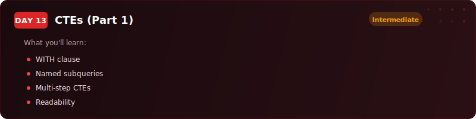
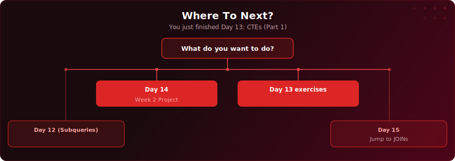

<p align="center">
  <a href="https://youtu.be/IijQJAfqcJc"></a>
</p>

<p align="center">
  <a href="https://youtu.be/IijQJAfqcJc"></a>
  
  
  
</p>

# Day 13 - CTEs (Part 1)

[<< Day 12: Subqueries & Temp Tables](../day-12/) | [Day 14: Project: Fleet Intelligence Pipeline >>](../day-14/)

---

## What You'll Learn

- What Common Table Expressions (CTEs) are and how the WITH keyword works
- How to define multiple CTEs in a single query, separated by commas
- How to chain CTEs into multi-step pipelines where each step feeds the next
- When to use a CTE versus a subquery versus a temp table
- Naming conventions that make your CTEs self-documenting

---

## Quick Setup

```sql
-- Run in pgAdmin (takes a few seconds)
\i setup.sql
```

Or open [`setup.sql`](setup.sql) and run the full script manually.

<details>
<summary>Verify your setup</summary>

```sql
-- Check your tables loaded correctly
SELECT COUNT(*) FROM your_table;
```

</details>

---

## Exercises

You are a data analyst working with the Head of Supply Chain Compliance, Claire Foster. She needs a traceability report that flags high-risk stages across your food supply chain.

Using the `supply_chain_stages` table, complete the tasks below.

### Task 1: Preview the Data

Write a query to explore the supply chain data. How many records are there? How many products? How many unique stages and locations?

### Task 2: Total Cost per Processing Stage

Write a CTE called `stage_costs` that calculates the total cost for each stage name across all products. In the main query, show each stage name and its total cost, sorted from most expensive to least.

### Task 3: Product-Level Summary

Write a CTE called `product_summary` that calculates each product's total cost and total duration (in days) across all stages. In the main query, show each product alongside its total cost, total days, and the number of stages it passes through.

### Task 4: Find the Bottleneck Stages

Build a two-CTE pipeline. The first CTE (`cost_per_day`) calculates the cost per day for each stage (cost / duration_days). The second CTE (`avg_cost_per_day`) calculates the overall average cost per day across all stages. In the main query, show only the stages where cost per day is above the overall average - these are the bottleneck stages Claire needs to escalate.

### Solutions

Finished? Check your answers: [`solutions.sql`](solutions.sql)

---

## Key Concepts

- **WITH keyword:** Defines named temporary result sets at the top of a query, referenced like tables below

---

## Where To Next?

<p align="center">
  
</p>

---

<p align="center">
  <a href="../day-12/">&#9664; Day 12: Subqueries & Temp Tables</a> &nbsp;&nbsp;|&nbsp;&nbsp; <a href="../day-14/">Day 14: Project: Fleet Intelligence Pipeline &#9654;</a>
</p>
