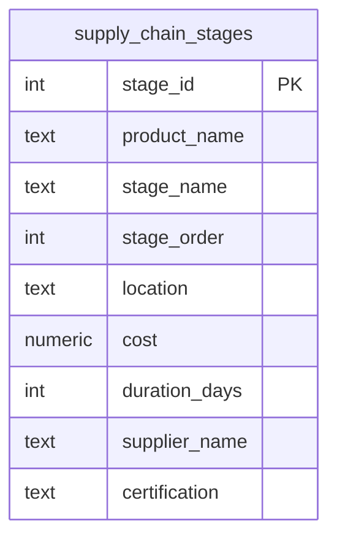

  

  
  
  
  
  

<h1 align="center">Day 13 &middot; Exercise Questions</h1>

  <a href="README.md">&#8592; Back to Day 13</a> &nbsp;&middot;&nbsp;
  <a href="exercise.sql">Exercise tables</a> &nbsp;&middot;&nbsp;
  <a href="solutions.sql">Solutions</a>

---

> [!NOTE]
> **How to use this page.** Run [`exercise.sql`](exercise.sql) first to create the tables and load the
> data, then answer the questions below **without opening the solutions**. Each one tells you what to
> return, and hides the expected result behind a toggle so you can check yourself once you have tried.
>
> The technique is deliberately not named. Working out which tool the question needs is most of the skill.

### Your run

- [ ] [1. Get your bearings](#q1)
- [ ] [2. Where the money goes by stage](#q2)
- [ ] [3. A product-level summary](#q3)
- [ ] [4. Find the bottlenecks](#q4)

---

## The scenario

You are working with Claire Foster, Head of Supply Chain Compliance. She needs a traceability report that flags high-risk stages across the food supply chain.

| Table | One row is |
|---|---|
| `supply_chain_stages` | one product at one stage, with its cost, duration and location |

> [!IMPORTANT]
> Every question after the first is easier to read if the intermediate result has a name. That is what the day is teaching.

---

### 1. Get your bearings

Before analysing anything, establish the shape of the data: how many records, how many distinct products, how many distinct stages, how many locations.

**Return:** four counts.

<b>Check yourself</b>

 

Distinct counts, not row counts. The difference is the point.

---

### 2. Where the money goes by stage

Total cost for each processing stage, most expensive first.

**Return:** stage name, total cost.

<b>Check yourself</b>

 

One row per stage.

---

### 3. A product-level summary

For each product: total cost, total days across all its stages, and how many stages it passes through. Most expensive product first.

**Return:** product name, total cost, total days, stage count.

<b>Check yourself</b>

 

One row per product.

---

### 4. Find the bottlenecks

A stage is a bottleneck when its cost per day is above the average cost per day across everything. Work out cost per day for each record, then return only those above that average - these are the stages Claire needs to escalate.

**Return:** stage id, product name, stage name, location, cost, duration, cost per day.

<b>Check yourself</b>

 

You need two things named before you can compare them: the per-record rate, and the overall average of those rates.

---

## When you are done

Compare against [`solutions.sql`](solutions.sql). If your query returns the right rows by a different
route, that is not a mistake - there is usually more than one correct answer.

> [!TIP]
> What matters is whether you can say **why you chose yours**, what it costs, and what would have to be
> true about the data for it to break. That question, not the syntax, is the one interviews are
> actually testing.

  <a href="../day-12/">&#8592; Day 12</a> &nbsp;&middot;&nbsp;
  <a href="README.md">Back to Day 13</a> &nbsp;&middot;&nbsp;
  <a href="../day-14/">Day 14 &#8594;</a>

