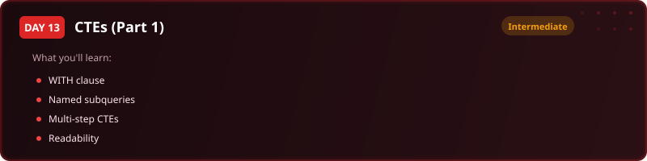

  

  
  
  
  

# Day 13 - Exercise Questions

[<< Back to Day 13](README.md) | [Exercise tables](exercise.sql) | [Solutions](solutions.sql)

---

**How to use this page.** Run [exercise.sql](exercise.sql) first to create the tables and load the
data. Then answer the questions below **without opening the solutions**. Each one tells you what to
return and gives you a way to check yourself. The technique is deliberately not named - working out
which tool the question needs is most of the skill.

Stuck? The video walks through every one of these.

---

## The scenario

You are working with Claire Foster, Head of Supply Chain Compliance. She needs a traceability report that flags high-risk stages across the food supply chain.

| Table | One row is |
|---|---|
| `supply_chain_stages` | one product at one stage, with its cost, duration and location |

**Every question after the first is easier to read if the intermediate result has a name. That is what the day is teaching.**

---

## Question 1 - Get your bearings

Before analysing anything, establish the shape of the data: how many records, how many distinct products, how many distinct stages, how many locations.

**Return:** four counts.

> **Check yourself:** Distinct counts, not row counts. The difference is the point.

---

## Question 2 - Where the money goes by stage

Total cost for each processing stage, most expensive first.

**Return:** stage name, total cost.

> **Check yourself:** One row per stage.

---

## Question 3 - A product-level summary

For each product: total cost, total days across all its stages, and how many stages it passes through. Most expensive product first.

**Return:** product name, total cost, total days, stage count.

> **Check yourself:** One row per product.

---

## Question 4 - Find the bottlenecks

A stage is a bottleneck when its cost per day is above the average cost per day across everything. Work out cost per day for each record, then return only those above that average - these are the stages Claire needs to escalate.

**Return:** stage id, product name, stage name, location, cost, duration, cost per day.

> **Check yourself:** You need two things named before you can compare them: the per-record rate, and the overall average of those rates.

---

## When you are done

Compare against [solutions.sql](solutions.sql). If your query returns the right rows by a different
route, that is not a mistake - there is usually more than one correct answer. What matters is
whether you can say **why you chose yours**, what it costs, and what would have to be true about the
data for it to break.

That question - not the syntax - is the one interviews are actually testing.

---

[<< Day 12](../day-12/) | [Back to Day 13](README.md) | [Day 14 >>](../day-14/)
