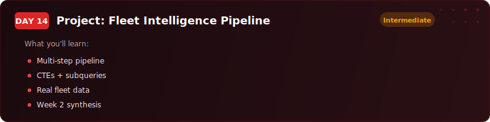
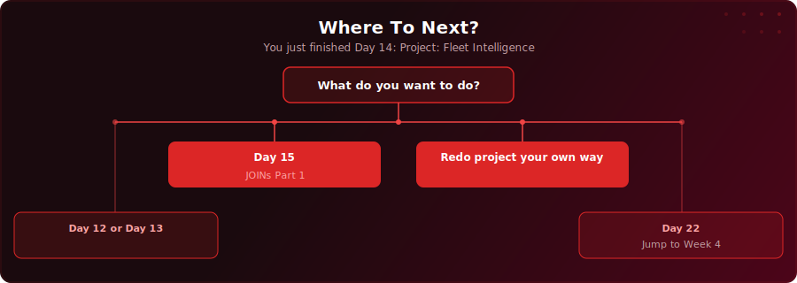

<p align="center">
  <a href="https://youtu.be/afIJ4VsQYSo"></a>
</p>

<p align="center">
  <a href="https://youtu.be/afIJ4VsQYSo"></a>
  
  
  
</p>

# Day 14 - Project: Fleet Intelligence Pipeline

[<< Day 13: CTEs (Part 1)](../day-13/) | [Day 15: JOINs Part 1: INNER, LEFT, RIGHT, FULL OUTER >>](../day-15/)

---

## What You'll Learn

- How to build a complete data pipeline in SQL - from raw sensor data to dashboard-ready output
- How to explore a real dataset for NULLs, error codes, and label inconsistencies before writing any transformations
- How to clean dirty data with UPDATE and preserve honest NULLs rather than faking values
- How to classify sensor readings by severity using CASE WHEN with multiple conditions
- How to collapse time-series data into daily and weekly summaries
- How to chain three CTEs together to detect vehicles trending toward failure
- How to produce a formatted Monday morning report with cost estimates and action labels

---

## Quick Setup

```sql
-- Run in pgAdmin (takes a few seconds)
\i setup.sql
```

Or open [`setup.sql`](setup.sql) and run the full script manually.

<details>
<summary>Verify your setup</summary>

```sql
-- Check your tables loaded correctly
SELECT 'fleet_vehicles' AS table_name, COUNT(*) AS row_count FROM fleet_vehicles
UNION ALL
SELECT 'sensor_readings', COUNT(*) FROM sensor_readings
UNION ALL
SELECT 'maintenance_log', COUNT(*) FROM maintenance_log;
```

You should see 20 rows in `fleet_vehicles`, 500 rows in `sensor_readings`, and 20 rows in `maintenance_log`.

</details>

---

---

<p align="center">
  <a href="https://www.youtube.com/@sdw-online?sub_confirmation=1"></a>
</p>

## Exercises

You are a data analyst at a UK logistics company. The fleet runs vans, trucks, and lorries across six depots - Bristol Hub, Leeds Depot, Glasgow Terminal, Birmingham Centre, Cardiff Depot, and Norwich Hub.

The operations director, **Sarah**, called a meeting this morning. Three problems landed on her desk:

1. **The sensor data is messy.** Some readings are NULL (sensors that disconnected mid-route), some show a value of -999 (the sensor's error code when it could not take a reading), and some sensor-type labels use inconsistent capitalisation - `engine_temp` and `Engine_Temp` appear as two separate sensors.
2. **There is no early warning system.** Vehicles only get flagged after they break down on the road. Sarah wants the database to catch dangerous readings automatically - overheating engines, worn brake pads, low oil pressure - before they become a breakdown.
3. **Breakdowns are expensive.** Each unplanned breakdown costs around $8,000. Sarah wants to know which vehicles are about to fail before they actually fail.

Your task: build a SQL pipeline that takes raw sensor readings and turns them into a priority list of vehicles that need maintenance this week. Seven phases, three tables, one Monday morning report.

### Step 1 - Explore the Raw Data

Run four exploration queries. Count the total rows in `sensor_readings`. Count how many distinct vehicles are reporting. Find the earliest and latest `reading_timestamp` to confirm the data covers January through March 2026. Count how many readings have a `reading_value` of -999 (the sensor error code). Then dig deeper: group by `sensor_type` to expose the capitalisation inconsistencies, and group by `sensor_status` with both `COUNT(*)` and `COUNT(reading_value)` to quantify how many readings are missing a value entirely.

### Step 2 - Clean the Sensor-Type Labels

All sensor-type labels should be lowercase with underscores. First, SELECT the distinct `sensor_type` values where `sensor_type != LOWER(sensor_type)` so you can see exactly what needs fixing. Then run an UPDATE using `LOWER(REPLACE(sensor_type, ' ', '_'))` on the rows that do not match. Verify with a final SELECT of all distinct sensor types - you should see exactly five clean labels: `brake_wear`, `engine_temp`, `fuel_level`, `oil_pressure`, `tyre_pressure`.

### Step 3 - Handle NULL Readings

Join `sensor_readings` to `fleet_vehicles` and use `COUNT(*) FILTER (WHERE reading_value IS NULL)` to count how many NULL readings each vehicle has, alongside the total and the NULL percentage. Use HAVING to exclude vehicles with zero NULLs. Do not delete NULL rows - they represent honest sensor disconnections. From Phase 3 onwards, add `WHERE reading_value IS NOT NULL` to every calculation query so NULLs are excluded from averages automatically.

### Step 4 - Replace the -999 Error Codes

First SELECT the rows where `reading_value = -999` to preview what will change. Then UPDATE those rows: set `reading_value = NULL` and `sensor_status = 'error'`. A NULL is honest - a -999 left in the data would drag every average down by dozens of units. Verify with a COUNT query confirming zero rows remain with `reading_value = -999`.

### Step 5 - Classify Readings by Severity

Write a CASE WHEN expression that tags every reading as `'critical'`, `'warning'`, or `'normal'` based on the thresholds Sarah's lead technician confirmed:

- `engine_temp`: below 95 = normal, 95-105 = warning, above 105 = critical
- `oil_pressure`: above 40 = normal, 25-40 = warning, below 25 = critical
- `brake_wear`: above 40% = normal, 20-40% = warning, below 20% = critical
- `tyre_pressure`: 32-42 = normal, slightly outside = warning, well outside (below 28 or above 45) = critical
- `fuel_level`: no thresholds - monitored only

Start with engine temperature alone so you can see the pattern, then expand to all five sensors. Always check critical before warning in CASE WHEN - the first match wins. Then wrap the classification in a subquery and use COUNT with a window function to show how many readings fall into each category and what percentage of the total they represent.

### Step 6 - Build Daily Summaries

Collapse the hourly readings into one row per vehicle per sensor per day. Use `DATE(reading_timestamp)` to strip the time and `GROUP BY vehicle_id, sensor_type, DATE(reading_timestamp)`. Add `ROUND(AVG(reading_value), 2)` as `daily_avg`, `MAX` as `daily_max`, and `MIN` as `daily_min`. Then add a fleet-level comparison: use a correlated subquery to calculate the fleet average for that same sensor on that same day, and subtract it from each vehicle's daily average to produce a `vs_fleet_avg` column. A positive number on `engine_temp` means that vehicle is running hotter than the rest of the fleet.

### Step 7 - Detect Vehicles Trending Toward Failure

Build a three-CTE chain. CTE 1 (`weekly_averages`): use `DATE_TRUNC('week', reading_timestamp)` to group readings into weekly buckets - weekly averages smooth out day-to-day noise. CTE 2 (`week_over_week`): add a `LAG` window function to compare each week's average to the previous week and calculate `week_change`. CTE 3 (`worsening_vehicles`): count how many weeks each vehicle-sensor combination moved in the wrong direction - rising for `engine_temp`, falling for `oil_pressure` and `brake_wear`, large swings for `tyre_pressure` - using `COUNT(*) FILTER (WHERE ...)`. Join to `fleet_vehicles` and filter to vehicles with two or more worsening weeks. One bad week could be a fluke; two is a pattern.

### Step 8 - Produce Sarah's Monday Morning Report

Extend the Phase 6 CTE chain with two more CTEs. CTE 4 (`latest_week`): filter `week_over_week` to the most recent week only, keeping both `current_reading` and `prev_reading` side by side. CTE 5 (`risk_scored`): apply the same CASE WHEN severity thresholds from Step 5, then add `estimated_repair_cost` and `estimated_downtime_hrs` using correlated subqueries into `maintenance_log` - use COALESCE so vehicles with no repair history default to $5,000 and 24 hours. The final SELECT joins to `fleet_vehicles`, formats the cost with `TO_CHAR` and a dollar sign, appends `' hrs'` to downtime, adds an `action` column (`PULL FROM SERVICE` / `SCHEDULE THIS WEEK`), filters to critical and warning only, and orders by severity then cost descending. Sarah runs this every Monday morning.

### Solutions

Finished? Check your answers: [`solutions.sql`](solutions.sql)

---

## Key Concepts

- **Explore first, clean second, analyse third** - never build a pipeline on data you have not audited; every phase builds on what you found in the last one
- **Honest NULLs vs fake values** - a NULL from a disconnected sensor is useful information; a -999 left in the data silently corrupts every average
- **CASE WHEN with multiple sensors** - each sensor has a different danger direction (rising engine temp is bad; falling oil pressure is bad); the conditions must reflect that
- **Correlated subqueries for comparison** - recalculate the fleet average per sensor per day for each row in the outer query; this is the pattern behind "how does this vehicle compare to the rest?"
- **Chained CTEs for pipelines** - each CTE does one job; weekly averages, then week-over-week change, then worsening count; the chain reads like a sequence of named steps

---

## Where To Next?

<p align="center">
  
</p>

---

<p align="center">
  <a href="../day-13/">&#9664; Day 13: CTEs (Part 1)</a> &nbsp;&nbsp;|&nbsp;&nbsp; <a href="../day-15/">Day 15: JOINs Part 1: INNER, LEFT, RIGHT, FULL OUTER &#9654;</a>
</p>

---

<!-- CLIFFHANGER -->
<p align="center"><sub><b>UP NEXT</b></sub></p>
<p align="center"><a href="https://www.youtube.com/watch?v=wtBxs_iDLo4"></a></p>
<p align="center"><b>Day 15 &nbsp;&middot;&nbsp; JOINs Part 1: INNER, LEFT, RIGHT, FULL OUTER</b></p>
<p align="center"><i>JOINs look easy until they silently drop your data.</i></p>
<!-- /CLIFFHANGER -->
