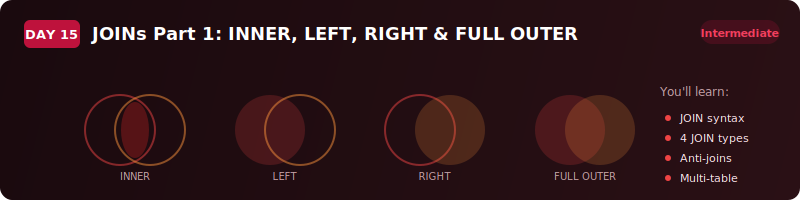
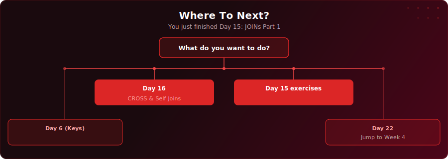

  

  
  
  

# Day 15 - JOINs Part 1: INNER, LEFT, RIGHT, FULL OUTER

[<< Day 14: Project: Fleet Intelligence Pipeline](../day-14/) | [Day 16: CROSS JOIN & Self Joins >>](../day-16/)

---

## What You'll Learn

- Why real databases split data across multiple tables (normalisation)
- INNER JOIN - returns only rows that match in both tables
- LEFT JOIN - keeps all rows from the left table, fills NULLs where no match
- RIGHT JOIN - the mirror image of LEFT JOIN (and why most people just use LEFT JOIN)
- FULL OUTER JOIN - returns all rows from both tables, NULLs on either side
- The anti-join pattern (LEFT JOIN + WHERE IS NULL) for finding missing relationships
- How to join three or more tables and choose the right JOIN type at each step

---

---

  

## Where To Next?

  

---

  <a href="../day-14/">&#9664; Day 14: Project: Fleet Intelligence Pipeline</a> &nbsp;&nbsp;|&nbsp;&nbsp; <a href="../day-16/">Day 16: CROSS JOIN & Self Joins &#9654;</a>

---

<!-- CLIFFHANGER -->

<b>UP NEXT</b>

<a href="../README.md#curriculum"><b>Day 16 coming soon &raquo;</b></a>

<b>Day 16 &nbsp;&middot;&nbsp; JOINs Part 2: CROSS & Self Joins</b>

<i>JOINs look easy until they silently drop your data.</i>

<!-- /CLIFFHANGER -->
