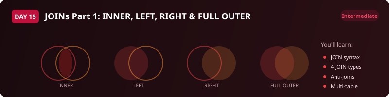
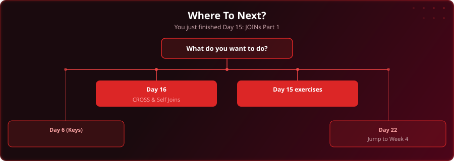

<p align="center">
  <a href="https://youtu.be/wtBxs_iDLo4"></a>
</p>

<p align="center">
  <a href="https://youtu.be/wtBxs_iDLo4"></a>
  
  
  
</p>

# Day 15 - JOINs Part 1

[<< Day 14: Project: Fleet Intelligence Pipeline](../day-14/) | [Day 16: JOINs Part 2: CROSS and Self >>](../day-16/)

---

### Contents
- [What You'll Learn](#what-youll-learn)
- [Dataset](#dataset)
- [Exercises](#exercises)
- [Key Concepts Covered](#key-concepts-covered)

---

## What You'll Learn
- What is a JOIN?
- INNER JOIN
- LEFT JOIN
- RIGHT JOIN
- FULL OUTER JOIN
- Anti-Join Pattern
- Multi-Table JOINs
- Homework
- What You Learned Today

## Prerequisites

> **First time here?** You need PostgreSQL and pgAdmin installed.
> [Watch the setup guide](https://youtu.be/g8GwhsVPaOg) | [Start from Day 1](../day-01/)

- Complete Days 1-14

## Dataset

Today uses 3 tables. Run the SQL in [setup.sql](setup.sql) to create the teaching tables, or run [exercise.sql](exercise.sql) for just the exercise tables.

- **users**: 8 rows
- **songs**: 12 rows
- **playlist_tracks**: 17 rows

### Setup

Run [setup.sql](setup.sql) to create and populate the teaching tables.

### Verification

After running the setup, verify your tables:

```sql
SELECT COUNT(*) FROM users; -- expected: 8 rows
SELECT COUNT(*) FROM songs; -- expected: 12 rows
SELECT COUNT(*) FROM playlist_tracks; -- expected: 17 rows
```

## Exercises

See video for the full exercise walkthrough.

### Exercise Setup

Run [exercise.sql](exercise.sql) to create the exercise tables.

- **incidents**
- **responder_units**
- **dispatches**
- **hospital_capacity**


## Key Concepts Covered

- What is a JOIN?
- INNER JOIN
- LEFT JOIN
- RIGHT JOIN
- FULL OUTER JOIN
- Anti-Join Pattern
- Multi-Table JOINs
- Exercise - Emergency Response Coordination
- Homework

---

[Watch the video](https://youtu.be/wtBxs_iDLo4) | [← Day 14: Project: Fleet Intelligence Pipeline](../day-14/) | [Day 16: JOINs Part 2: CROSS and Self →](../day-16/)

---

<p align="center">
  <a href="https://www.youtube.com/@sdw-online?sub_confirmation=1"></a>
</p>

## Where To Next?

<p align="center">
  
</p>

---

<p align="center">
  <a href="../day-14/">&#9664; Day 14: Project: Fleet Intelligence Pipeline</a> &nbsp;&nbsp;|&nbsp;&nbsp; <a href="../day-16/">Day 16: JOINs Part 2: CROSS and Self &#9654;</a>
</p>

---

<!-- CLIFFHANGER -->
<p align="center"><sub><b>UP NEXT</b></sub></p>
<p align="center"><a href="https://www.youtube.com/watch?v=ZYwPGw4ghkI"></a></p>
<p align="center"><b>Day 16 &nbsp;&middot;&nbsp; JOINs Part 2: CROSS and Self</b></p>
<p align="center"><i>The two JOINs nobody explains properly.</i></p>
<!-- /CLIFFHANGER -->
