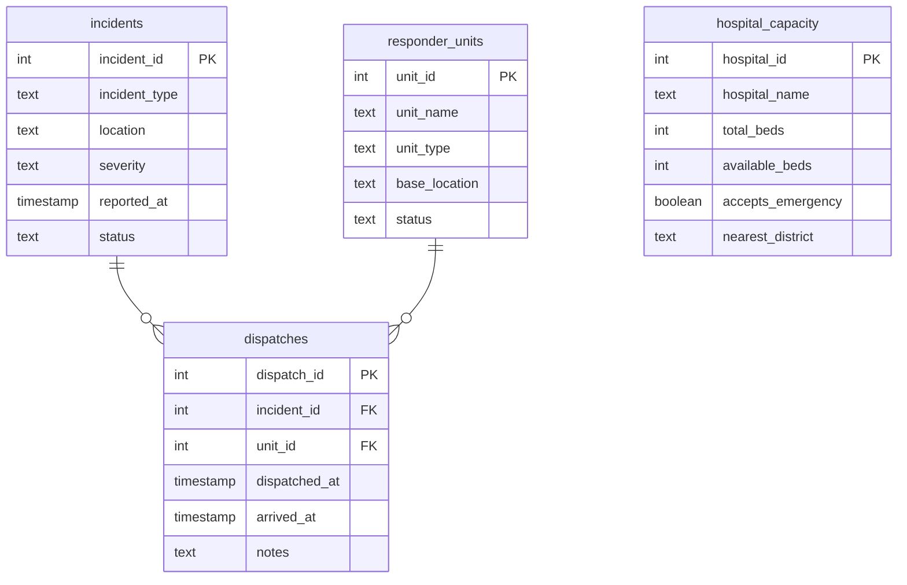

  

  
  
  
  
  

<h1 align="center">Day 15 &middot; Exercise Questions</h1>

  <a href="README.md">&#8592; Back to Day 15</a> &nbsp;&middot;&nbsp;
  <a href="exercise.sql">Exercise tables</a> &nbsp;&middot;&nbsp;
  <a href="solutions.sql">Solutions</a>

---

> [!NOTE]
> **How to use this page.** Run [`exercise.sql`](exercise.sql) first to create the tables and load the
> data, then answer the questions below **without opening the solutions**. Each one tells you what to
> return, and hides the expected result behind a toggle so you can check yourself once you have tried.
>
> The technique is deliberately not named. Working out which tool the question needs is most of the skill.

### Your run

- [ ] [1. Who attended what](#q1)
- [ ] [2. Every incident, attended or not](#q2)
- [ ] [3. The ones nobody went to](#q3)
- [ ] [4. Which hospitals could actually take them](#q4)

---

## The scenario

An emergency response service logs incidents, dispatches responder units to them, and tracks which hospitals have capacity.

| Table | One row is |
|---|---|
| `incidents` | one reported incident |
| `responder_units` | one unit that can be sent |
| `dispatches` | one unit being sent to one incident |
| `hospital_capacity` | one hospital and its current capacity |

> [!IMPORTANT]
> Note the shape before you start: an incident can have many dispatches, and some incidents have none at all. That is the whole point of the day.

---

### 1. Who attended what

Control wants a line for every incident a unit was actually sent to, showing the incident type, its severity, which unit attended, when it was dispatched and when it arrived.

**Return:** incident id, incident type, severity, unit name, unit type, dispatched at, arrived at, ordered by when the incident was reported.

<b>Check yourself</b>

 

Incidents that nobody was sent to must not appear.

---

### 2. Every incident, attended or not

Now the opposite: every incident on the books, whether or not a unit was ever sent, with the dispatch details where they exist and blanks where they do not.

**Return:** incident id, incident type, severity, status, dispatch id, unit name, ordered by when the incident was reported.

<b>Check yourself</b>

 

This must return more rows than question 1. If it returns the same number, something in your query is quietly filtering the unattended incidents back out.

---

### 3. The ones nobody went to

From that same list, produce only the incidents with no dispatch at all. This is the report that gets escalated, so it must not miss any.

**Return:** incident id, incident type, severity, status, when it was reported.

<b>Check yourself</b>

 

4 rows. The exercise script's own validation queries agree with that number.

---

### 4. Which hospitals could actually take them

Each incident has a location, and each hospital serves an area - you will need to pull the area out of the text rather than compare the whole string. For every incident, show the hospitals in the matching area with their available capacity.

**Return:** incident id, incident type, location, hospital name, available beds, ordered by incident then hospital.

<b>Check yourself</b>

 

An incident in an area with no listed hospital should still tell you something useful. Decide whether it belongs in your result, and be ready to say why.

---

## When you are done

Compare against [`solutions.sql`](solutions.sql). If your query returns the right rows by a different
route, that is not a mistake - there is usually more than one correct answer.

> [!TIP]
> What matters is whether you can say **why you chose yours**, what it costs, and what would have to be
> true about the data for it to break. That question, not the syntax, is the one interviews are
> actually testing.

  <a href="../day-14/">&#8592; Day 14</a> &nbsp;&middot;&nbsp;
  <a href="README.md">Back to Day 15</a> &nbsp;&middot;&nbsp;
  <a href="../day-16/">Day 16 &#8594;</a>

