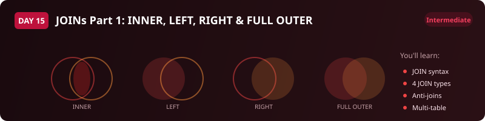

  

  
  
  
  

# Day 15 - Exercise Questions

[<< Back to Day 15](README.md) | [Exercise tables](exercise.sql) | [Solutions](solutions.sql)

---

**How to use this page.** Run [exercise.sql](exercise.sql) first to create the tables and load
the data. Then answer the questions below **without opening the solutions**. Each one tells you
what to return and gives you a way to check yourself. The technique is deliberately not named -
working out which tool the question needs is most of the skill.

Stuck? The video walks through every one of these.

---

## The scenario

An emergency response service logs **incidents**, dispatches **responder units** to them, and
tracks which **hospitals** have capacity. Four tables:

| Table | One row is |
|---|---|
| `incidents` | one reported incident |
| `responder_units` | one unit that can be sent |
| `dispatches` | one unit being sent to one incident |
| `hospital_capacity` | one hospital and its current capacity |

Note the shape before you start: an incident can have **many** dispatches, and some incidents
have **none**. That is the whole point of the day.

---

## Question 1 - Who attended what

Control wants a line for every incident that a unit was actually sent to, showing the incident
type, its severity, which unit attended, when it was dispatched and when it arrived.

**Return:** incident id, incident type, severity, unit name, unit type, dispatched at, arrived at.
**Order by:** when the incident was reported.

> **Check yourself:** incidents that nobody was sent to must not appear.

---

## Question 2a - Every incident, attended or not

Now the operations manager wants the opposite: **every** incident on the books, whether or not a
unit was ever sent, with the dispatch details where they exist and blanks where they do not.

**Return:** incident id, incident type, severity, status, dispatch id, unit name.
**Order by:** when the incident was reported.

> **Check yourself:** this must return more rows than Question 1. If it returns the same number,
> something in your query is quietly filtering the unattended incidents back out.

---

## Question 2b - The ones nobody went to

From that same list, produce only the incidents that have **no** dispatch at all. This is the
report that gets escalated, so it must not miss any.

**Return:** incident id, incident type, severity, status, when it was reported.

> **Check yourself:** 4 rows. The exercise script's validation queries agree with that number.

---

## Question 3 - Which hospitals could actually take them

Each incident has a `location`. Each hospital in `hospital_capacity` serves an area, and you will
need to pull the area out of the text rather than compare the whole string.

For every incident, show the hospitals in the matching area along with their available capacity,
so a dispatcher can see at a glance where a casualty could go.

**Return:** incident id, incident type, location, hospital name, available beds.
**Order by:** incident id, then hospital name.

> **Check yourself:** an incident in an area with no listed hospital should still tell you
> something useful. Decide whether it belongs in your result and be ready to say why.

---

## When you are done

Compare against [solutions.sql](solutions.sql). If your query returns the right rows by a
different route, that is not a mistake - two correct answers to a JOIN question are common. What
matters is whether you can say **why you chose yours**, what it costs, and what would have to be
true about the data for it to break.

That question - not the syntax - is the one interviews are actually testing.

---

[<< Day 14](../day-14/) | [Back to Day 15](README.md) | [Day 16 >>](../day-16/)
