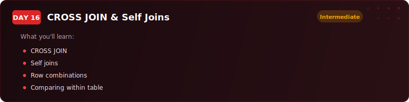
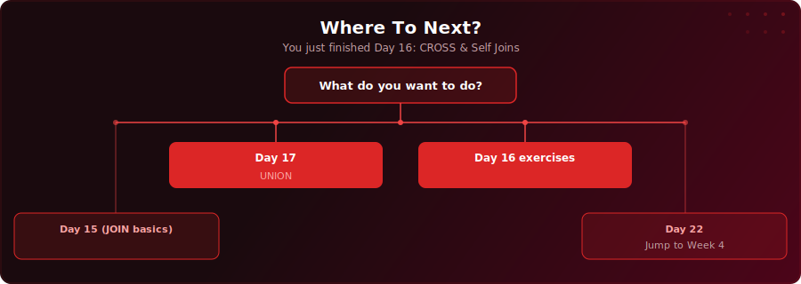

  

  
  
  

# Day 16 - CROSS JOIN & Self Joins

[<< Day 15: JOINs Part 1: INNER, LEFT, RIGHT, FULL OUTER](../day-15/) | [Day 17: UNION & UNION ALL >>](../day-17/)

---

## What You'll Learn

- How CROSS JOIN generates every possible combination of two tables - and when you'd actually want that
- How self joins let you join a table to itself to query hierarchies, compare rows, and find colleague pairs
- How non-equi joins match values to ranges using BETWEEN instead of equals
- The `<` trick for producing unique pairs without duplicates

---

## Where To Next?

  

---

  <a href="../day-15/">&#9664; Day 15: JOINs Part 1: INNER, LEFT, RIGHT, FULL OUTER</a> &nbsp;&nbsp;|&nbsp;&nbsp; <a href="../day-17/">Day 17: UNION & UNION ALL &#9654;</a>

