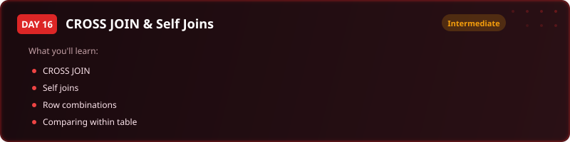
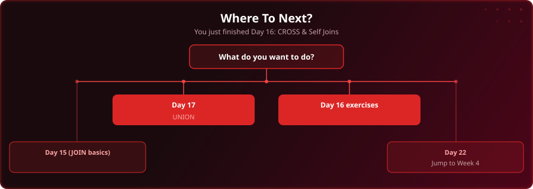

<p align="center">
  <a href="https://youtu.be/ZYwPGw4ghkI"></a>
</p>

<p align="center">
  <a href="https://youtu.be/ZYwPGw4ghkI"></a>
  
  
  
</p>

# Day 16 - JOINs Part 2: CROSS and Self

[<< Day 15: JOINs Part 1](../day-15/) | [Day 17: UNION and UNION ALL >>](../day-17/)

---

### Contents
- [What You'll Learn](#what-youll-learn)
- [Dataset](#dataset)
- [Exercises](#exercises)
- [Key Concepts Covered](#key-concepts-covered)

---

## What You'll Learn
- What is a CROSS JOIN?
- CROSS JOIN in Action
- CROSS JOIN - Watch the Row Count
- What is a Self Join?
- Self Join for Comparisons
- Homework
- What You Learned Today

## Prerequisites

> **First time here?** You need PostgreSQL and pgAdmin installed.
> [Watch the setup guide](https://youtu.be/g8GwhsVPaOg) | [Start from Day 1](../day-01/)

- Complete Days 1-15

## Dataset

Today uses 2 tables. Run the SQL in [setup.sql](setup.sql) to create the teaching tables, or run [exercise.sql](exercise.sql) for just the exercise tables.

- **airports**: 6 rows
- **flights**: 13 rows

### Setup

Run [setup.sql](setup.sql) to create and populate the teaching tables.

### Verification

After running the setup, verify your tables:

```sql
SELECT COUNT(*) FROM airports; -- expected: 6 rows
SELECT COUNT(*) FROM flights; -- expected: 13 rows
```

## Exercises

- **Moderate** gets "MONITOR - schedule follow-up".
- **Low **gets "NOTE - document in records".

And that's the deliverable done.

The report now shows 
- every dangerous combination, 
- every affected patient, 
- both prescribing doctors, and 
- a clear action for each one. 

Nneka can hand this straight to the clinical board.

You pulled that together using both of today's new patterns - 
- a CROSS JOIN to generate the pairs, and 
- a self join to line up each patient's medicines.

Now let's clean up.

> 📋 **PASTE THIS** - drop all Day 16 tables

```sql
DROP TABLE IF EXISTS patient_prescriptions;
DROP TABLE IF EXISTS interactions;
DROP TABLE IF EXISTS medications;
DROP TABLE IF EXISTS flights;
DROP TABLE IF EXISTS airports; 
```

All clean.


---

### Exercise Setup

Run [exercise.sql](exercise.sql) to create the exercise tables.

- **medications**
- **interactions**
- **patient_prescriptions**


## Key Concepts Covered

- What is a CROSS JOIN?
- CROSS JOIN in Action
- CROSS JOIN - Watch the Row Count
- What is a Self Join?
- Self Join for Comparisons
- Exercise - Drug Interaction Safety Report
- Homework

---

[Watch the video](https://www.youtube.com/watch?v=ZYwPGw4ghkI) | [← Day 15: JOINs Part 1](../day-15/) | [Day 17: UNION and UNION ALL →](../day-17/)

---

<p align="center">
  <a href="https://www.youtube.com/@sdw-online?sub_confirmation=1"></a>
</p>

## Where To Next?

<p align="center">
  
</p>

---

<p align="center">
  <a href="../day-15/">&#9664; Day 15: JOINs Part 1</a> &nbsp;&nbsp;|&nbsp;&nbsp; <a href="../day-17/">Day 17: UNION and UNION ALL &#9654;</a>
</p>

---

<!-- CLIFFHANGER -->
<p align="center"><sub><b>UP NEXT</b></sub></p>
<p align="center"><a href="https://www.youtube.com/watch?v=wlohArgOSd4"></a></p>
<p align="center"><b>Day 17 &nbsp;&middot;&nbsp; UNION and UNION ALL</b></p>
<p align="center"><i>Stacking results is easy. Knowing which one to use is not.</i></p>
<!-- /CLIFFHANGER -->
