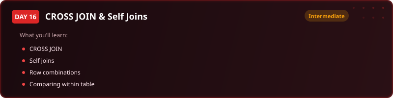
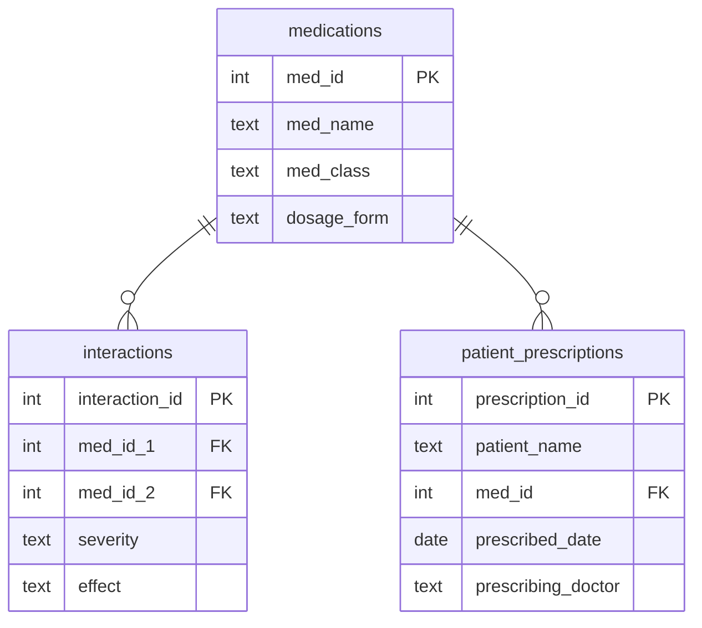

  

  
  
  
  
  

<h1 align="center">Day 16 &middot; Exercise Questions</h1>

  <a href="README.md">&#8592; Back to Day 16</a> &nbsp;&middot;&nbsp;
  <a href="exercise.sql">Exercise tables</a> &nbsp;&middot;&nbsp;
  <a href="solutions.sql">Solutions</a>

---

> [!NOTE]
> **How to use this page.** Run [`exercise.sql`](exercise.sql) first to create the tables and load the
> data, then answer the questions below **without opening the solutions**. Each one tells you what to
> return, and hides the expected result behind a toggle so you can check yourself once you have tried.
>
> The technique is deliberately not named. Working out which tool the question needs is most of the skill.

### Your run

- [ ] [1. Every possible pair of drugs](#q1)
- [ ] [2. Only the dangerous pairs](#q2)
- [ ] [3. Patients on more than one medication](#q3)
- [ ] [4. The dangerous combinations actually prescribed](#q4)
- [ ] [5. Tell the pharmacist what to do](#q5)

---

## The scenario

A pharmacy system holds medications, known dangerous interactions between them, and what each patient is currently prescribed. Nneka needs a report she can hand straight to the clinical board.

| Table | One row is |
|---|---|
| `medications` | one medication, with its class |
| `interactions` | one known dangerous pair, with severity and effect |
| `patient_prescriptions` | one medication prescribed to one patient, by one doctor |

> [!IMPORTANT]
> Two of these ask you to combine a table with itself. The trap throughout is producing each pair twice, once in each direction.

---

### 1. Every possible pair of drugs

Produce every unique pair of medications that could be checked against each other, with each drug's class.

**Return:** drug 1, class 1, drug 2, class 2, ordered by both names.

<b>Check yourself</b>

 

Aspirin with Warfarin is the same pair as Warfarin with Aspirin, and no drug pairs with itself. If your count looks roughly double what you expected, that is why.

---

### 2. Only the dangerous pairs

Narrow that to the pairs that appear in the known interactions table, with the severity and the effect.

**Return:** drug 1, class 1, drug 2, class 2, severity, effect.

<b>Check yourself</b>

 

This must be a small fraction of the previous answer.

---

### 3. Patients on more than one medication

Find patients prescribed two or more medications at once, showing both drugs and which doctor prescribed each.

**Return:** patient name, medication 1, medication 2, doctor 1, doctor 2.

<b>Check yourself</b>

 

Same pairing trap as question 1, this time within a patient.

---

### 4. The dangerous combinations actually prescribed

This is the report that matters clinically: patients whose prescribed pair appears in the interactions table.

**Return:** patient name, drug 1, drug 2, severity, effect, and both prescribing doctors.

<b>Check yourself</b>

 

Two different doctors on one row is exactly the situation this report exists to surface.

---

### 5. Tell the pharmacist what to do

Add a recommended action driven by the severity, so the output is actionable rather than merely alarming.

**Return:** as above, plus both drug classes and a recommended action.

<b>Check yourself</b>

 

A severity with no matching action rule must not produce a blank instruction.

---

## When you are done

Compare against [`solutions.sql`](solutions.sql). If your query returns the right rows by a different
route, that is not a mistake - there is usually more than one correct answer.

> [!TIP]
> What matters is whether you can say **why you chose yours**, what it costs, and what would have to be
> true about the data for it to break. That question, not the syntax, is the one interviews are
> actually testing.

  <a href="../day-15/">&#8592; Day 15</a> &nbsp;&middot;&nbsp;
  <a href="README.md">Back to Day 16</a> &nbsp;&middot;&nbsp;
  <a href="../day-17/">Day 17 &#8594;</a>

