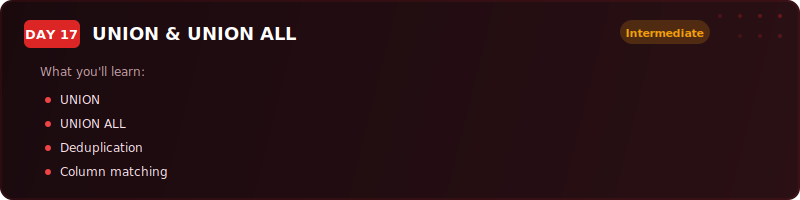
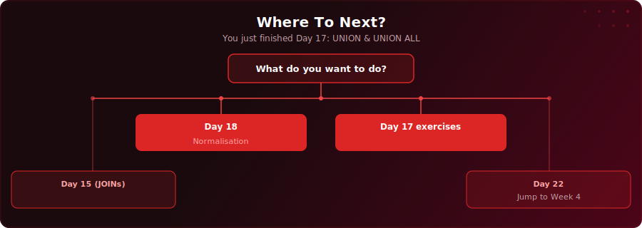

  

  
  
  

# Day 17 - UNION & UNION ALL

[<< Day 16: CROSS JOIN & Self Joins](../day-16/) | [Day 18: Normalisation & Denormalisation >>](../day-18/)

---

## What You'll Learn

- How UNION stacks rows from multiple queries and removes duplicates
- How UNION ALL stacks rows and keeps everything - and why it should be your default
- The strict column rules that both queries must follow
- How to use source tagging, INTERSECT, and EXCEPT for real-world data merging

---

## Where To Next?

  

---

  <a href="../day-16/">&#9664; Day 16: CROSS JOIN & Self Joins</a> &nbsp;&nbsp;|&nbsp;&nbsp; <a href="../day-18/">Day 18: Normalisation & Denormalisation &#9654;</a>

