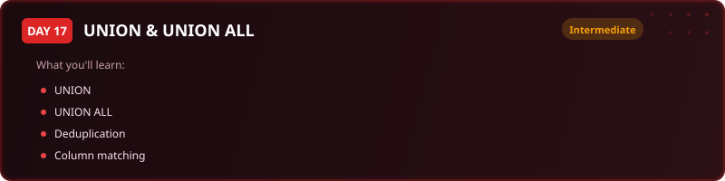
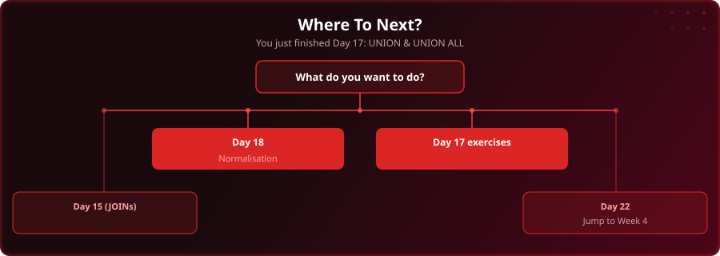

<p align="center">
  <a href="https://youtu.be/wlohArgOSd4"></a>
</p>

<p align="center">
  <a href="https://youtu.be/wlohArgOSd4"></a>
  
  
  
</p>

# Day 17 - UNION and UNION ALL

[<< Day 16: JOINs Part 2: CROSS and Self](../day-16/) | [Day 18: Normalisation and Denormalisation >>](../day-18/)

---

### Contents
- [What You'll Learn](#what-youll-learn)
- [Dataset](#dataset)
- [Exercises](#exercises)
- [Key Concepts Covered](#key-concepts-covered)

---

## What You'll Learn
- What is UNION?
- UNION ALL - Keep Everything
- Source Tagging - Label Where Each Row Came From
- INTERSECT and EXCEPT - The Rest of the Family
- Homework
- What You Learned Today

## Prerequisites

> **First time here?** You need PostgreSQL and pgAdmin installed.
> [Watch the setup guide](https://youtu.be/g8GwhsVPaOg) | [Start from Day 1](../day-01/)

- Complete Days 1-16

## Dataset

Today uses 2 tables. Run the SQL in [setup.sql](setup.sql) to create the teaching tables, or run [exercise.sql](exercise.sql) for just the exercise tables.

- **spotify_songs**: 14 rows
- **youtube_songs**: 12 rows

### Setup

Run [setup.sql](setup.sql) to create and populate the teaching tables.

### Verification

After running the setup, verify your tables:

```sql
SELECT COUNT(*) FROM spotify_songs; -- expected: 14 rows
SELECT COUNT(*) FROM youtube_songs; -- expected: 12 rows
```

## Exercises

The Head of Finance is called **Rachel**.

Her job is to make sure every invoice gets paid, and **no money slips through the cracks**.

She's asking us to build her a **reconciliation report **-
> ▶ **NEXT** - the goal (money out vs money in)
In short, she wants us to 
- calculate the money that went **out **against 
- the money that came **in**, and 
- check they agree with each other.

Here's what Rachel is asking for, broken into steps.

- First, **explore** the two tables.
> ▶ **NEXT** - Task 1 card
- Task 1 - **combine** every invoice and every payment into one labelled view.
> ▶ **NEXT** - Task 2 card
- Task 2 - find the invoices that have **no matching payment** - the overdue ones.
> ▶ **NEXT** - Task 3 card
- Task 3 - pull it all together into a **per-client summary**: invoiced, paid, and the difference.

Let's start.

### Exercise Setup

Run [exercise.sql](exercise.sql) to create the exercise tables.

- **invoices_sent**
- **payments_received**


## Key Concepts Covered

- What is UNION?
- UNION ALL - Keep Everything
- Source Tagging - Label Where Each Row Came From
- INTERSECT and EXCEPT - The Rest of the Family
- Exercise - Invoice and Payment Reconciliation
- Homework

---

[Watch the video](https://youtu.be/wlohArgOSd4) | [← Day 16: JOINs Part 2: CROSS and Self](../day-16/) | [Day 18: Normalisation and Denormalisation →](../day-18/)

---

<p align="center">
  <a href="https://www.youtube.com/@sdw-online?sub_confirmation=1"></a>
</p>

## Where To Next?

<p align="center">
  
</p>

---

<p align="center">
  <a href="../day-16/">&#9664; Day 16: JOINs Part 2: CROSS and Self</a> &nbsp;&nbsp;|&nbsp;&nbsp; <a href="../day-18/">Day 18: Normalisation and Denormalisation &#9654;</a>
</p>

---

<!-- CLIFFHANGER -->
<p align="center"><sub><b>UP NEXT</b></sub></p>
<p align="center"><a href="https://www.youtube.com/watch?v=dhdWwX8DAEg"></a></p>
<p align="center"><b>Day 18 &nbsp;&middot;&nbsp; Normalisation and Denormalisation</b></p>
<p align="center"><i>Every duplicate row is a decision someone did not make.</i></p>
<!-- /CLIFFHANGER -->
