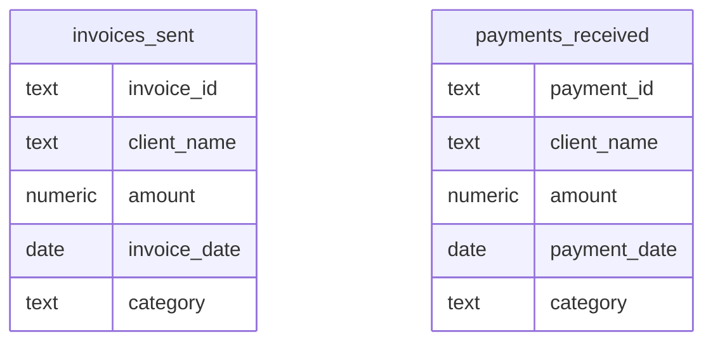

  

  
  
  
  
  

<h1 align="center">Day 17 &middot; Exercise Questions</h1>

  <a href="README.md">&#8592; Back to Day 17</a> &nbsp;&middot;&nbsp;
  <a href="exercise.sql">Exercise tables</a> &nbsp;&middot;&nbsp;
  <a href="solutions.sql">Solutions</a>

---

> [!NOTE]
> **How to use this page.** Run [`exercise.sql`](exercise.sql) first to create the tables and load the
> data, then answer the questions below **without opening the solutions**. Each one tells you what to
> return, and hides the expected result behind a toggle so you can check yourself once you have tried.
>
> The technique is deliberately not named. Working out which tool the question needs is most of the skill.

### Your run

- [ ] [1. One combined transaction ledger](#q1)
- [ ] [2. Invoices with no matching payment](#q2)
- [ ] [3. Invoices that were paid](#q3)
- [ ] [4. Per-client reconciliation](#q4)

---

## The scenario

Rachel, the Head of Finance, wants a reconciliation report: the money that went out against the money that came in, checked against each other so nothing slips through. Invoices and payments sit in two separate tables with the same shape.

| Table | One row is |
|---|---|
| `invoices_sent` | one invoice, with client, amount, date and category |
| `payments_received` | one payment, with client, amount, date and category |

> [!IMPORTANT]
> Two of these turn on whether duplicates should be removed. Choosing wrongly changes the totals without any error appearing.

---

### 1. One combined transaction ledger

Stack invoices and payments into a single list, each row labelled with which it came from.

**Return:** type, reference id, client name, amount, transaction date, category.

<b>Check yourself</b>

 

Every row from both tables must survive. If two clients happen to share an amount and a date you still need both rows, so think carefully about which set operator you reach for.

---

### 2. Invoices with no matching payment

Which invoices have nothing corresponding in the payments table?

**Return:** client name, amount, category.

<b>Check yourself</b>

 

Compare like with like: both sides must select the same columns in the same order.

---

### 3. Invoices that were paid

The mirror image: invoices that do have a match in payments.

**Return:** client name, amount, category.

<b>Check yourself</b>

 

Questions 2 and 3 together should account for every distinct invoice line.

---

### 4. Per-client reconciliation

Rachel needs, for each client: total invoiced, total paid, and the outstanding balance.

**Return:** client name, total invoiced, total paid, balance.

<b>Check yourself</b>

 

A client who has paid everything should show a balance of zero, not a blank.

---

## When you are done

Compare against [`solutions.sql`](solutions.sql). If your query returns the right rows by a different
route, that is not a mistake - there is usually more than one correct answer.

> [!TIP]
> What matters is whether you can say **why you chose yours**, what it costs, and what would have to be
> true about the data for it to break. That question, not the syntax, is the one interviews are
> actually testing.

  <a href="../day-16/">&#8592; Day 16</a> &nbsp;&middot;&nbsp;
  <a href="README.md">Back to Day 17</a> &nbsp;&middot;&nbsp;
  <a href="../day-18/">Day 18 &#8594;</a>

