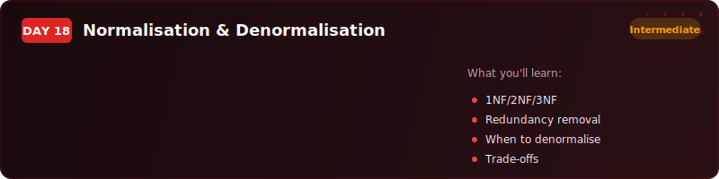
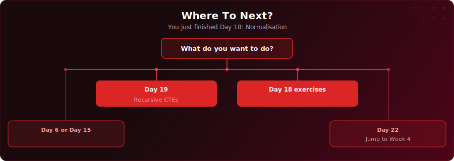

  

  
  
  

# Day 18 - Normalisation & Denormalisation

[<< Day 17: UNION & UNION ALL](../day-17/) | [Day 19: Recursive CTEs >>](../day-19/)

---

## What You'll Learn

- Why poorly structured tables cause update, insertion, and deletion anomalies
- The three normal forms (1NF, 2NF, 3NF) and how to apply them step by step
- How to split a messy flat table into focused, normalised tables
- When and why experienced engineers deliberately denormalise for read performance

---

## Key Concepts

- **Normalisation:** A set of rules for organising data so each fact is stored exactly once, eliminating update, insertion, and deletion anomalies

---

## Where To Next?

  

---

  <a href="../day-17/">&#9664; Day 17: UNION & UNION ALL</a> &nbsp;&nbsp;|&nbsp;&nbsp; <a href="../day-19/">Day 19: Recursive CTEs &#9654;</a>

