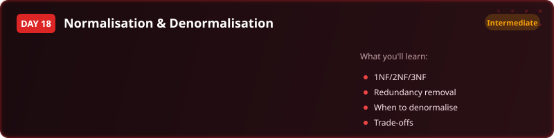
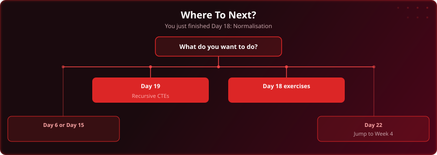

<p align="center">
  <a href="https://youtu.be/dhdWwX8DAEg"></a>
</p>

<p align="center">
  <a href="https://youtu.be/dhdWwX8DAEg"></a>
  
  
  
</p>

# Day 18 - Normalisation & Denormalisation

[<< Day 17: UNION & UNION ALL](../day-17/) | [Day 19: Recursive CTEs >>](../day-19/)

---

## What You'll Learn

- Why poorly structured tables cause update, insertion, and deletion anomalies
- The three normal forms (1NF, 2NF, 3NF) and how to apply them step by step
- How to split a messy flat table into focused, normalised tables
- When and why experienced engineers deliberately denormalise for read performance

---

## Quick Setup

```sql
-- Run in pgAdmin (takes a few seconds)
\i setup.sql
\i exercise.sql
```

Or open [`setup.sql`](setup.sql) and [`exercise.sql`](exercise.sql) and run each script manually.

<details>
<summary>Verify your setup</summary>

```sql
-- Check your tables loaded correctly
SELECT 'song_plays' AS table_name, COUNT(*) AS row_count FROM song_plays
UNION ALL
SELECT 'census_raw', COUNT(*) FROM census_raw;
```

Expected: `song_plays` 17, `census_raw` 20.

</details>

---

## Exercises

You work on the data team at a national statistics office. **Amira**, the Operations Lead for the census, needs the raw census data restructured before the reporting deadline.

You have one table: `census_raw` (20 rows across 9 households).

> "We need the census data restructured before the reporting deadline. First - preview the raw data and tell me how bad the redundancy is. Then split it into properly structured tables, prove the structure works with a JOIN, and finally build a denormalised view for the reporting dashboard so the team can see the difference in query complexity."

### Task 1: Split Into Normalised Tables

Split `census_raw` into six focused tables that fix all three normal-form violations along the way: `census_regions` (the 3NF fix - `region_type` depends on the region, not the person), `census_households` (each address stored once), `census_persons` (the 2NF fix - one row per person, linked back to their household), `census_languages` (the 1NF fix - one row per language, split out of the comma-separated list), `census_enumerators`, and `census_enumerator_phones` (another 1NF fix - one row per phone number). Migrate the data with DISTINCT where a fact should land once, and without it where every row is a real, separate person. Expected: 4 regions, 9 households, 20 persons, 34 languages, 4 enumerators, 5 phone numbers.

### Task 2: Reconstruct With a JOIN

Prove the normalised structure works. JOIN `census_persons`, `census_households`, and `census_regions` back together to reassemble the full picture - person, household, and region details pulled from three separate tables. Expected: 20 rows.

### Task 3: Denormalise for Reporting (Capstone)

Build a view called `v_census_report` that joins the same three tables, so the reporting team can query one view instead of writing the JOIN themselves every time. Then use it to find the population per region. Expected: 4 rows - East 7, North 6, South 4, West 3.

### Solutions

Finished? Check your answers: [`solutions.sql`](solutions.sql)

---

## Key Concepts

- **Normalisation:** Splitting one big table into smaller, focused tables so each fact is stored exactly once - one source of truth, no duplicates.
- **1NF (First Normal Form):** Every cell holds one value only, and every row is uniquely identifiable. Fixes multi-value cells like a comma-separated list of languages.
- **2NF (Second Normal Form):** Every non-key column depends on the WHOLE key, not just part of it. Only matters when your primary key is a composite key.
- **3NF (Third Normal Form):** Every non-key column depends on the key directly, never through another non-key column in the middle (a transitive dependency).
- **Denormalisation:** Deliberately adding duplication back in - pre-joining tables, pre-calculating totals - so reads are fast. The source of truth stays normalised; the reporting layer gets denormalised.
- **OLTP vs OLAP:** OLTP (Online Transaction Processing) is the normalised, write-heavy operational database. OLAP (Online Analytical Processing) is the denormalised, read-heavy reporting layer that dashboards and BI tools query.

---

## Where To Next?

<p align="center">
  
</p>

---

<p align="center">
  <a href="../day-17/">&#9664; Day 17: UNION & UNION ALL</a> &nbsp;&nbsp;|&nbsp;&nbsp; <a href="../day-19/">Day 19: Recursive CTEs &#9654;</a>
</p>

---

<!-- CLIFFHANGER -->
<p align="center"><sub><b>UP NEXT</b></sub></p>
<p align="center"><a href="../README.md#curriculum"><b>Day 19 coming soon &raquo;</b></a></p>
<p align="center"><b>Day 19 &nbsp;&middot;&nbsp; Recursive CTEs</b></p>
<p align="center"><i>CTEs are why your seniors read SQL faster than you. Yet.</i></p>
<!-- /CLIFFHANGER -->
