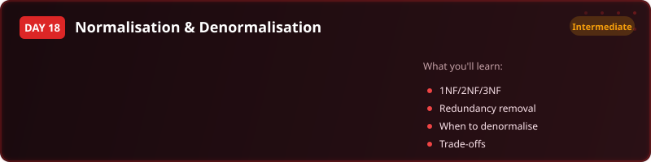
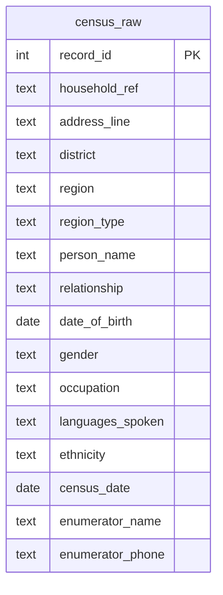

  

  
  
  
  
  

<h1 align="center">Day 18 &middot; Exercise Questions</h1>

  <a href="README.md">&#8592; Back to Day 18</a> &nbsp;&middot;&nbsp;
  <a href="exercise.sql">Exercise tables</a> &nbsp;&middot;&nbsp;
  <a href="solutions.sql">Solutions</a>

---

> [!NOTE]
> **How to use this page.** Run [`exercise.sql`](exercise.sql) first to create the tables and load the
> data, then answer the questions below **without opening the solutions**. Each one tells you what to
> return, and hides the expected result behind a toggle so you can check yourself once you have tried.
>
> The technique is deliberately not named. Working out which tool the question needs is most of the skill.

### Your run

- [ ] [1. Split it into normalised tables](#q1)
- [ ] [2. Put it back together](#q2)
- [ ] [3. Denormalise deliberately for reporting](#q3)

---

## The scenario

A census extract arrives as one wide table, with one row per person and the household and region details repeated on every row.

| Table | One row is |
|---|---|
| `census_raw` | one person, plus their household address and region details repeated inline |

> [!IMPORTANT]
> This day changes the shape of the data rather than querying it. Read the columns first and ask which facts belong to the person, which to the household, and which to the region.

---

### 1. Split it into normalised tables

Break the wide table into three: one for regions, one for households, one for people. Address details belong to a household rather than repeating per person, and region type belongs to a region rather than to a person.

**Return:** three table definitions, plus the inserts that populate them from the raw table.

<b>Check yourself</b>

 

Each address should now be stored once. If an address still appears three times for a three-person household, the split has not gone far enough.

---

### 2. Put it back together

Prove the split was lossless by reconstructing the original view from your three tables.

**Return:** person name, relationship, occupation, address line, district, region, region type.

<b>Check yourself</b>

 

20 rows, matching the original. A different number means something was lost or duplicated in the split.

---

### 3. Denormalise deliberately for reporting

Dashboards do not want three tables. Build a reporting layer that presents the joined-up view, while the normalised tables remain the source of truth.

**Return:** a view combining person, household and region detail.

<b>Check yourself</b>

 

Be ready to say why the reporting layer is allowed to repeat data when the base tables are not. That argument is the whole day.

---

## When you are done

Compare against [`solutions.sql`](solutions.sql). If your query returns the right rows by a different
route, that is not a mistake - there is usually more than one correct answer.

> [!TIP]
> What matters is whether you can say **why you chose yours**, what it costs, and what would have to be
> true about the data for it to break. That question, not the syntax, is the one interviews are
> actually testing.

  <a href="../day-17/">&#8592; Day 17</a> &nbsp;&middot;&nbsp;
  <a href="README.md">Back to Day 18</a> &nbsp;&middot;&nbsp;
  <a href="../day-19/">Day 19 &#8594;</a>

