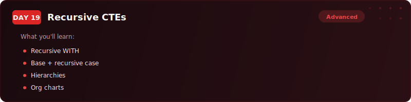
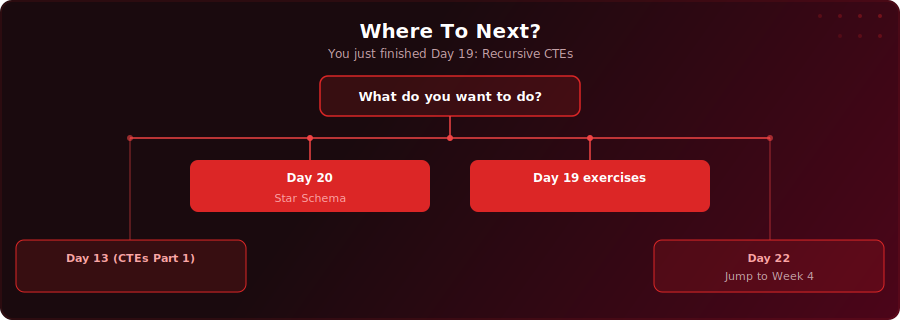

  

  
  
  

# Day 19 - Recursive CTEs

[<< Day 18: Normalisation & Denormalisation](../day-18/) | [Day 20: Data Modelling (Star Schema) >>](../day-20/)

---

## What You'll Learn

- How recursive CTEs walk through tree-shaped data one level at a time
- The two-part structure: anchor member (starting rows) and recursive member (next level)
- How to traverse org charts, category trees, folder hierarchies, and bill of materials
- How to add safety limits and detect cycles to prevent infinite recursion

---

## Key Concepts

- **Recursive CTE structure:** An anchor member (starting rows) connected to a recursive member (next level) by UNION ALL - the recursive member references the CTE's own name

---

## Where To Next?

  

---

  <a href="../day-18/">&#9664; Day 18: Normalisation & Denormalisation</a> &nbsp;&nbsp;|&nbsp;&nbsp; <a href="../day-20/">Day 20: Data Modelling (Star Schema) &#9654;</a>

