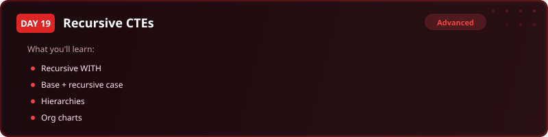
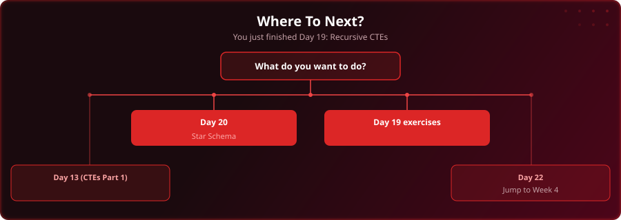

<p align="center">
  <a href="https://youtu.be/DI1swwiKxUc"></a>
</p>

<p align="center">
  <a href="https://youtu.be/DI1swwiKxUc"></a>
  
  
  
</p>

# Day 19 - Recursive CTEs

[<< Day 18: Normalisation and Denormalisation](../day-18/) | [Day 20: Data Modelling (Star Schema) >>](../day-20/)

---

### Contents
- [What You'll Learn](#what-youll-learn)
- [Dataset](#dataset)
- [Exercises](#exercises)
- [Key Concepts Covered](#key-concepts-covered)

---

## What You'll Learn
- What Is a Recursive CTE?
- The Simplest Recursion - Counting
- Walking a Real Family Tree
- Generating Sequences
- Cycle Detection and Limits
- Homework
- What You Learned Today

## Prerequisites

> **First time here?** You need PostgreSQL and pgAdmin installed.
> [Watch the setup guide](https://youtu.be/g8GwhsVPaOg) | [Start from Day 1](../day-01/)

- Complete Days 1-18

## Dataset

Today uses 2 tables. Run the SQL in [setup.sql](setup.sql) to create the teaching tables, or run [exercise.sql](exercise.sql) for just the exercise tables.

- **family_tree**: 20 rows
- **suppliers**: 20 rows

### Setup

Run [setup.sql](setup.sql) to create and populate the teaching tables.

### Verification

After running the setup, verify your tables:

```sql
SELECT COUNT(*) FROM family_tree; -- expected: 20 rows
SELECT COUNT(*) FROM suppliers; -- expected: 20 rows
```

## Exercises

The Supply Chain Director is **Ifeoma**, and she’s sent us a message:

> 💬 I need the full supplier network mapped for the quarterly review. Preview the data first. Show me all my Tier 1 suppliers. Trace the full chain from Tier 1 down to Tier 3. Tell me how deep each product line's chain goes. And give me a monthly timeline for my review schedule.
> ▶ **NEXT** - reveal Task 1: Map the Direct Suppliers

Here is what Ifeoma is asking for, broken into steps:

- Find all the Tier 1 suppliers, then 
> ▶ **NEXT** - reveal Task 2: Trace the Full Chain
- find the deepest tier for each product line we have, then we 
> ▶ **NEXT** - reveal Task 3: Ifeoma's Final Reports
- generate a monthly review timeline she can use 
> ▶ **NEXT** - all tasks revealed

Let's start.

### Exercise Setup

Run [exercise.sql](exercise.sql) to create the exercise tables.


## Key Concepts Covered

- What Is a Recursive CTE?
- The Simplest Recursion - Counting
- Walking a Real Family Tree
- Generating Sequences
- Cycle Detection and Limits
- Exercise - Supply Chain Tier Mapping
- Homework

---

[Watch the video](https://youtu.be/DI1swwiKxUc) | [← Day 18: Normalisation and Denormalisation](../day-18/) | [Day 20: Data Modelling (Star Schema) →](../day-20/)

---

<p align="center">
  <a href="https://www.youtube.com/@sdw-online?sub_confirmation=1"></a>
</p>

## Where To Next?

<p align="center">
  
</p>

---

<p align="center">
  <a href="../day-18/">&#9664; Day 18: Normalisation and Denormalisation</a> &nbsp;&nbsp;|&nbsp;&nbsp; <a href="../day-20/">Day 20: Data Modelling (Star Schema) &#9654;</a>
</p>

---

<!-- CLIFFHANGER -->
<p align="center"><sub><b>UP NEXT</b></sub></p>
<p align="center"><a href="https://www.youtube.com/watch?v=bZjfSWOIsBI"></a></p>
<p align="center"><b>Day 20 &nbsp;&middot;&nbsp; Data Modelling (Star Schema)</b></p>
<p align="center"><i>Design the model wrong and every query pays for it.</i></p>
<!-- /CLIFFHANGER -->
