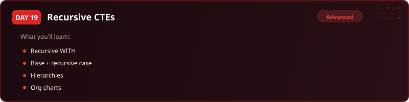
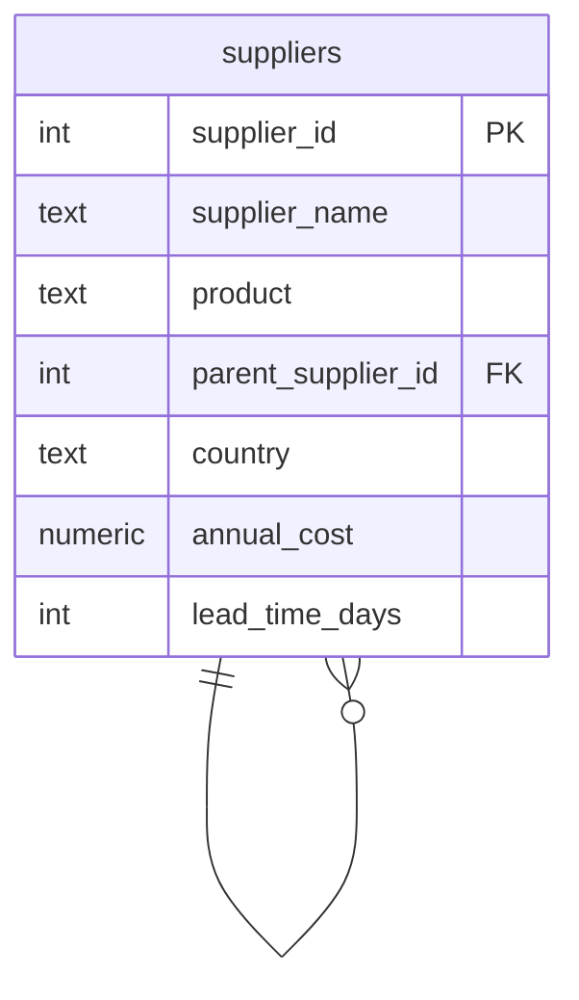

  

  
  
  
  
  

<h1 align="center">Day 19 &middot; Exercise Questions</h1>

  <a href="README.md">&#8592; Back to Day 19</a> &nbsp;&middot;&nbsp;
  <a href="exercise.sql">Exercise tables</a> &nbsp;&middot;&nbsp;
  <a href="solutions.sql">Solutions</a>

---

> [!NOTE]
> **How to use this page.** Run [`exercise.sql`](exercise.sql) first to create the tables and load the
> data, then answer the questions below **without opening the solutions**. Each one tells you what to
> return, and hides the expected result behind a toggle so you can check yourself once you have tried.
>
> The technique is deliberately not named. Working out which tool the question needs is most of the skill.

### Your run

- [ ] [1. Find the top of the tree](#q1)
- [ ] [2. Walk the whole chain](#q2)
- [ ] [3. How deep does each chain run](#q3)
- [ ] [4. A monthly timeline with no table behind it](#q4)

---

## The scenario

Ifeoma, the Supply Chain Director, needs the full supplier network mapped for the quarterly review. It is a hierarchy: Tier 1 suppliers buy from Tier 2, who buy from Tier 3, and each row points at its parent.

| Table | One row is |
|---|---|
| `suppliers` | one supplier, with its product, country, annual cost and a pointer to its parent supplier |

> [!IMPORTANT]
> A row pointing at another row in the same table is a tree. You cannot walk it with a fixed number of joins unless you already know how deep it goes.

---

### 1. Find the top of the tree

List the direct suppliers - the ones that answer to nobody - most expensive first. No recursion needed yet.

**Return:** supplier name, product, country, annual cost.

<b>Check yourself</b>

 

4 rows. These are the starting points for everything that follows.

---

### 2. Walk the whole chain

Now traverse the full network, labelling every supplier with the tier it sits at.

**Return:** supplier name, product, country, annual cost, tier.

<b>Check yourself</b>

 

20 rows: 4 at tier 1, 8 at tier 2, 8 at tier 3. If it never stops, your recursive step is not moving down the tree.

---

### 3. How deep does each chain run

For each Tier 1 supplier, how many suppliers sit beneath it and how deep does its chain go? Every row needs to remember which Tier 1 supplier it ultimately traces back to.

**Return:** root supplier, deepest tier, supplier count.

<b>Check yourself</b>

 

4 rows, one per Tier 1 supplier.

---

### 4. A monthly timeline with no table behind it

A different use of the same tool: generate the monthly timeline Ifeoma wants for her review schedule - one row per month for 2025, without a calendar table.

**Return:** 12 dates, January to December 2025.

<b>Check yourself</b>

 

No source table at all. The first row is written by hand and each pass adds a month, stopping at December.

---

## When you are done

Compare against [`solutions.sql`](solutions.sql). If your query returns the right rows by a different
route, that is not a mistake - there is usually more than one correct answer.

> [!TIP]
> What matters is whether you can say **why you chose yours**, what it costs, and what would have to be
> true about the data for it to break. That question, not the syntax, is the one interviews are
> actually testing.

  <a href="../day-18/">&#8592; Day 18</a> &nbsp;&middot;&nbsp;
  <a href="README.md">Back to Day 19</a> &nbsp;&middot;&nbsp;
  <a href="../day-20/">Day 20 &#8594;</a>

