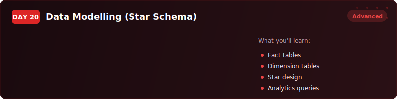
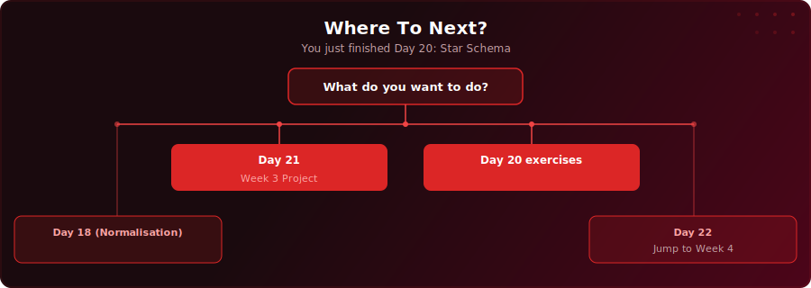

  

  
  
  

# Day 20 - Data Modelling (Star Schema)

[<< Day 19: Recursive CTEs](../day-19/) | [Day 21: Project: SaaS Trial-to-Paid Conversion >>](../day-21/)

---

## What You'll Learn

- What a star schema is and why it is the industry standard for analytics
- The difference between fact tables (measurable events) and dimension tables (descriptive context)
- Why grain is the most critical design decision in any data model
- How surrogate keys, summary tables, and date dimensions make analytical queries fast and reliable

---

## Key Concepts

- **Star schema:** A fact table in the centre surrounded by dimension tables - designed for fast, simple analytical queries with minimal joins

---

## Where To Next?

  

---

  <a href="../day-19/">&#9664; Day 19: Recursive CTEs</a> &nbsp;&nbsp;|&nbsp;&nbsp; <a href="../day-21/">Day 21: Project: SaaS Trial-to-Paid Conversion &#9654;</a>

