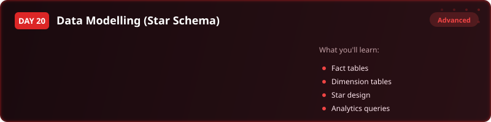
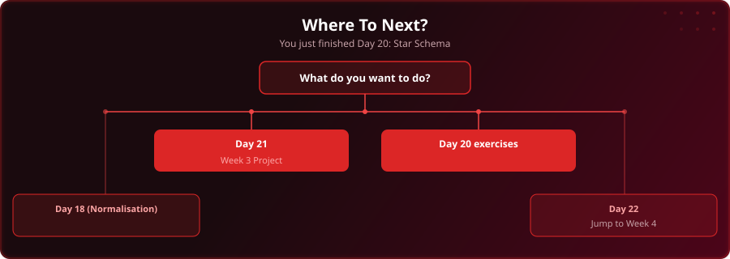

<p align="center">
  <a href="https://youtu.be/bZjfSWOIsBI"></a>
</p>

<p align="center">
  <a href="https://youtu.be/bZjfSWOIsBI"></a>
  
  
  
</p>

# Day 20 - Data Modelling (Star Schema)

[Watch the video](https://youtu.be/bZjfSWOIsBI) | [← Day 19: Recursive CTEs](../day-19/) | [Day 21: Project: Recruitment Analytics →](../day-21/)

---

### Contents
- [What You'll Learn](#what-youll-learn)
- [Dataset](#dataset)
- [Exercises](#exercises)
- [Key Concepts Covered](#key-concepts-covered)

---

## What You'll Learn

- What data modelling is, and why the shape of your tables decides how fast your queries run
- Fact tables - the measurable events, and why grain is the most important decision you make
- Dimension tables - the descriptive context that makes a fact readable
- How to connect facts to dimensions with surrogate keys
- Bridge tables - how to resolve a many-to-many without breaking the star
- Star vs snowflake, and when the extra normalisation is worth it
- How to design your own star schema from scratch

## Prerequisites

> **First time here?** You need PostgreSQL and pgAdmin installed.
> [Watch the setup guide](https://youtu.be/g8GwhsVPaOg) | [Start from Day 1](../day-01/)

- Complete Days 1-19

## Dataset

Today uses two datasets. Run the SQL in [setup.sql](setup.sql) to create everything, or run [exercise.sql](exercise.sql) for just the exercise tables.

**Teaching dataset - cinema ticket sales.** One fact table surrounded by dimensions, plus a bridge that resolves the films-to-actors many-to-many:

- **fact_ticket_sales**: the fact table, grain is one ticket sold
- **dim_films**, **dim_cinemas**, **dim_customers**, **dim_actors**: the dimensions
- **bridge_film_actors**: 18 rows, resolves films to actors

**Exercise dataset - renewable energy generation.** Grain is one row per site per month:

- **generation_fact**: 96 rows
- **sites**: 8 rows
- **regions**: 4 rows
- **time_periods**: 12 rows
- **site_region_supply**: 19 rows, the bridge from sites to regions

### Setup

Run [setup.sql](setup.sql) to create and populate both the teaching and the exercise tables.

### Verification

After running the setup, verify your exercise tables:

```sql
SELECT COUNT(*) FROM generation_fact; -- expected: 96 rows
SELECT COUNT(*) FROM sites; -- expected: 8 rows
SELECT COUNT(*) FROM regions; -- expected: 4 rows
SELECT COUNT(*) FROM time_periods; -- expected: 12 rows
SELECT COUNT(*) FROM site_region_supply; -- expected: 19 rows
```

## Exercises

You are the Energy Transition Analyst. You track how much electricity the country generates and how much of it is actually renewable, across sites, regions and months.

The catch is in the model. There is no `region_id` on the fact table. Regions connect through `site_region_supply`, a bridge, because one site can supply several regions and one region can be fed by several sites. Getting to a region means going through the bridge, and knowing when NOT to go through it matters just as much.

Here is what you need to work out:

- **Task 1 - Explore the model.** Count every table and peek at the fact and the bridge. Work out which table is the fact and which are the dimensions just from their shape.
- **Task 2 - Through the bridge.** How many sites feed each region? And which regions does each renewable site supply?
- **Task 3 - Renewable vs non-renewable share.** What percentage of total generation is renewable? This one is a clean star query off the fact plus one dimension. Going through the bridge here would double-count every site that supplies more than one region.

### Exercise Setup

Run [exercise.sql](exercise.sql) to create just the exercise tables.

Solutions are in [solutions.sql](solutions.sql). Try each task yourself first.

## Key Concepts Covered

- What Is Data Modelling?
- Fact Tables
- Dimension Tables
- Connecting the Tables
- Bridge Tables
- Star vs Snowflake
- Where the Star Comes From
- Designing Your Own Star Schema
- Homework
- What You Learned Today

---

<p align="center">
  <a href="https://www.youtube.com/@sdw-online?sub_confirmation=1"></a>
</p>

## Where To Next?

<p align="center">
  
</p>

---

<p align="center">
  <a href="../day-19/">&#9664; Day 19: Recursive CTEs</a> &nbsp;&nbsp;|&nbsp;&nbsp; <a href="../day-21/">Day 21: Project: Recruitment Analytics &#9654;</a>
</p>

---

<!-- CLIFFHANGER -->
<p align="center"><sub><b>UP NEXT</b></sub></p>
<p align="center"><a href="../README.md#curriculum"><b>Day 21 coming soon &raquo;</b></a></p>
<p align="center"><b>Day 21 &nbsp;&middot;&nbsp; Project: Recruitment Analytics</b></p>
<p align="center"><i>The day you stop learning and start building.</i></p>
<!-- /CLIFFHANGER -->
