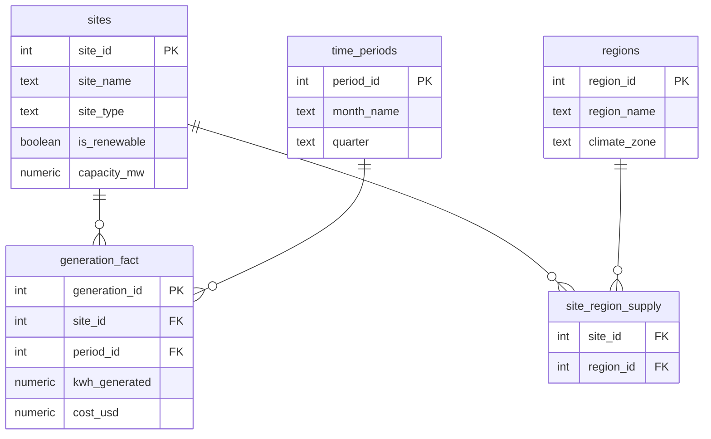

  

  
  
  
  
  

<h1 align="center">Day 20 &middot; Exercise Questions</h1>

  <a href="README.md">&#8592; Back to Day 20</a> &nbsp;&middot;&nbsp;
  <a href="exercise.sql">Exercise tables</a> &nbsp;&middot;&nbsp;
  <a href="solutions.sql">Solutions</a>

---

> [!NOTE]
> **How to use this page.** Run [`exercise.sql`](exercise.sql) first to create the tables and load the
> data, then answer the questions below **without opening the solutions**. Each one tells you what to
> return, and hides the expected result behind a toggle so you can check yourself once you have tried.
>
> The technique is deliberately not named. Working out which tool the question needs is most of the skill.

### Your run

- [ ] [1. Read the shape of the model](#q1)
- [ ] [2. Through the bridge](#q2)
- [ ] [3. Renewable against non-renewable share](#q3)

---

## The scenario

An energy company models generation data as a star schema: one fact table surrounded by dimensions, plus a bridge table because a site can supply more than one region.

| Table | One row is |
|---|---|
| `generation_fact` | one generation measurement, for one site in one period |
| `sites` | one generation site, with its energy source |
| `regions` | one region |
| `time_periods` | one time period |
| `site_region_supply` | one site supplying one region - the bridge |

> [!IMPORTANT]
> Look at the row counts before you write anything. The big table is the fact and the small ones are dimensions. Which table a question needs is usually decided by which column it asks about.

---

### 1. Read the shape of the model

Count every table so you can tell which is the fact and which are the dimensions.

**Return:** table name and row count, for all five.

<b>Check yourself</b>

 

96 generation rows against 8 sites is the giveaway. If you cannot tell which is the fact table, you cannot plan a query against it.

---

### 2. Through the bridge

How many sites feed each region, most first?

**Return:** region name, site count.

<b>Check yourself</b>

 

There is no region on the fact table. If you tried to start there, that is the lesson: the bridge is the only route.

---

### 3. Renewable against non-renewable share

Split total generation into renewable and non-renewable, and express each as a percentage of the whole.

**Return:** energy source, total generation, percentage share.

<b>Check yourself</b>

 

The two percentages must add to 100. Going through the bridge here would double-count any site supplying more than one region, so ask yourself whether this question needs it at all.

---

## When you are done

Compare against [`solutions.sql`](solutions.sql). If your query returns the right rows by a different
route, that is not a mistake - there is usually more than one correct answer.

> [!TIP]
> What matters is whether you can say **why you chose yours**, what it costs, and what would have to be
> true about the data for it to break. That question, not the syntax, is the one interviews are
> actually testing.

  <a href="../day-19/">&#8592; Day 19</a> &nbsp;&middot;&nbsp;
  <a href="README.md">Back to Day 20</a> &nbsp;&middot;&nbsp;
  <a href="../day-21/">Day 21 &#8594;</a>

