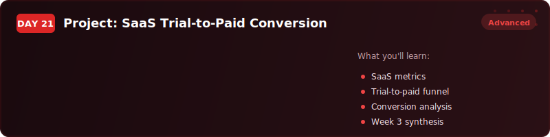
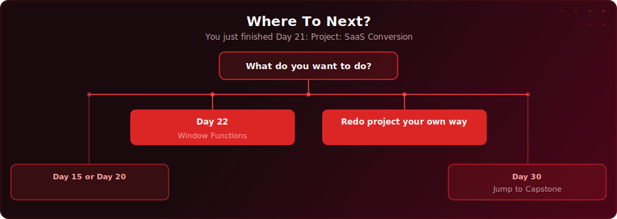

  

  
  
  

# Day 21 - Project: SaaS Trial-to-Paid Conversion

[<< Day 20: Data Modelling (Star Schema)](../day-20/) | [Day 22: Window Functions Part 1 >>](../day-22/)

---

## What You'll Learn

- How to build a complete SaaS conversion funnel analysis using JOINs, anti-joins, UNION ALL, and CTEs
- How to segment users by engagement level and correlate engagement with conversion rates
- How to calculate conversion timing, revenue analysis, and produce board-ready recommendations with SQL

---

## Key Concepts

- **Funnel analysis with LEFT JOINs** - preserving drop-offs that INNER JOIN would hide

---

## Where To Next?

  

---

  <a href="../day-20/">&#9664; Day 20: Data Modelling (Star Schema)</a> &nbsp;&nbsp;|&nbsp;&nbsp; <a href="../day-22/">Day 22: Window Functions Part 1 &#9654;</a>

