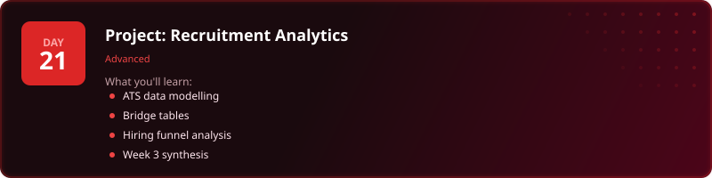
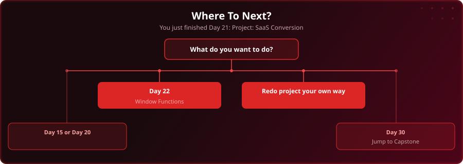

<p align="center">
  <a href="../day-21/"></a>
</p>

<p align="center">
  
  
  
</p>

# Day 21 - Project: Recruitment Analytics

[<< Day 20: Data Modelling (Star Schema)](../day-20/) | [Day 22: Window Functions Part 1 >>](../day-22/)

---

### Contents
- [What You'll Learn](#what-youll-learn)
- [Dataset](#dataset)
- [Exercises](#exercises)
- [Key Concepts Covered](#key-concepts-covered)

---

## What You'll Learn

- The medallion architecture - raw, silver and gold, and why a real pipeline keeps all three
- How to audit a raw extract: looking for issues, not insights, and never cleaning the raw layer itself
- How to clean as you normalise - standardise the casing, drop what you cannot identify, dedupe, and null what cannot be true
- How to split a multi-valued cell into first normal form, and why that split is what surfaces a hidden many-to-many
- How to take a 3NF model apart again and rebuild it as a Kimball star
- Why the junction table from the normalised layer is the bridge table in the star, not a new invention
- How to walk the bridge to answer questions the raw export could not answer at all

## Prerequisites

> **First time here?** You need PostgreSQL and pgAdmin installed.
> [Watch the setup guide](https://youtu.be/g8GwhsVPaOg) | [Start from Day 1](../day-01/)

- Complete Days 1-20. This project leans hardest on Day 15 (JOINs), Day 18 (normalisation) and Day 20 (star schemas)

## Dataset

Today there is one dataset and it arrives dirty on purpose. Run [setup.sql](setup.sql) to land the raw layer - three tables, exactly as an applicant tracking system would dump them:

- **raw_job_postings**: 500 rows, one per open role. `required_skills` crams every skill for a role into a single semicolon-separated cell, and `cost_centre` repeats on every row of the same department
- **raw_applications**: 11,970 rows, one per application. Candidate name, email and source channel repeat on every row that person ever filed
- **raw_skills**: 60 rows, the skills taxonomy - the official list of skill names and their categories

Roughly a third of the application rows carry at least one quality issue: a missing email, a decision dated before the application, or a job reference that points at nothing. Finding those is Phase 1 of the project.

Nothing else is provided. The six silver tables and the five gold tables are what you build.

### Setup

Run [setup.sql](setup.sql) to land the raw layer. Re-running it is safe - it drops the raw tables and anything you have already built, so you always restart from a clean slate.

### Verification

After running the setup, verify your raw tables:

```sql
SELECT COUNT(*) FROM raw_job_postings; -- expected: 500 rows
SELECT COUNT(*) FROM raw_applications; -- expected: 11970 rows
SELECT COUNT(*) FROM raw_skills; -- expected: 60 rows
```

## Exercises

You are working with **Julian Marsden**, the Analytics Lead at a tech company. They have just switched on an AI assistant inside their hiring software - ask it a question in plain English, get an answer back.

The VP tried it first. He asked which skills they hire for most, whether they are chasing SQL or Python, and why Data Science costs the most and takes the longest. The answers came back garbled. The assistant's top result was "SQL; Excel - 17 roles", because every skill for a role lives in one cell with semicolons between them. It counted a pair of skills as if it were a single skill, and did the same for every other combination.

The assistant is not broken. The data underneath it is. A company that wants to be AI-ready is only as ready as its data, and right now Julian's only alternative is exporting thousands of rows into a spreadsheet and cleaning them by hand every time the VP asks.

Your job is to build the clean model the assistant should have been reading from. Five phases, three layers, one star schema at the end.

### Step 1 - Audit the raw layer

Auditing is not exploring. Exploring looks for insights; auditing looks for issues. Work through nine of them, and do not fix anything yet - the raw layer stays exactly as it landed so you can always re-derive from it.

Start with the shape problems. Look at `raw_job_postings` and see the semicolon cell, then use `STRING_TO_ARRAY` with `ARRAY_LENGTH` to find the longest list hiding in one of those cells. Count the distinct department and cost centre pairs once the casing is cleaned up, and notice `cost_centre` depends on the department rather than the job. Group `raw_applications` by candidate name and email to see how badly the candidate details repeat.

Then the dirt. Count the distinct `department` values and compare that to how many departments really exist. Split `required_skills` with `STRING_TO_TABLE` and find every token that is not in the `raw_skills` taxonomy. Count the applications with a NULL `candidate_email`. Find the candidate and job pairs that appear more than once - filter out the NULL emails first, or they all collapse into one group and inflate the count. Count the rows where `decided_date` is earlier than `applied_date`. Finally, anti-join `raw_applications` to `raw_job_postings` to find the orphans, then look at what the orphan rows have in common.

### Step 2 - Design the model

No SQL in this phase. Sketch the model before you build it, because the SQL in the next two phases is only the drawing typed out.

Decide which thing is the fact and which are the dimensions, and fix the grain - one row per application. Then walk every pair of entities and ask the cardinality question in both directions: how many jobs can one department have, and how many departments can one job have? Do that for jobs to applications (a job posted this morning has zero applications, so the circle matters), candidates to applications, and jobs to skills. That last pair comes back many on both ends, which is the one shape a star cannot draw directly - and that is the pair that needs a bridge. Finally decide whether to fold `department` into the job dimension or snowflake it out.

### Step 3 - Transform the data into the silver layer (3NF)

Build six tables, and fix each audit finding as part of building the table it belongs to.

`departments` first: `INITCAP(TRIM(department))` collapses eighteen spellings back to three, and the `SERIAL` surrogate key needs an `ORDER BY 1, 2` on the load so the ids come out the same every time you rebuild. Then `skills`, a straight lift of the taxonomy with a surrogate key. Then `jobs`, joined to `departments` on the cleaned name so the dirty spellings still resolve.

`job_skills` is the one that matters. `STRING_TO_TABLE` explodes the semicolon cell into one row per job and skill, `TRIM` and `LOWER` on both sides of the join make the match case-insensitive, and a `CASE` handles the single real abbreviation in the data. Give it a composite primary key on both columns and add `DISTINCT`, because the mangling produced within-cell duplicates the key would otherwise reject. The many-to-many that was hiding inside that cell now exists as rows.

Then `candidates`, where the constraints are the cleaning rules written down - `NOT NULL` on the name, email and source channel, and `UNIQUE` on the email, because the email is the person. Finally `applications`, where two inner joins do the work of two separate cleans (joining to `candidates` drops the null-email rows, joining to `jobs` drops the orphans), a `CASE` nulls the impossible decision dates, and `DISTINCT ON` with an `ORDER BY` on the application id keeps the earliest of each duplicate pair. Do not store `days_to_decision` - it is derived from two columns you already have.

### Step 4 - Build the presentation layer (the gold star)

Now take the normalised model apart again and rebuild it for reading. Silver is modelled for integrity; gold is modelled for speed.

`dim_job` folds `department` and `cost_centre` back in as text - the opposite of what you just did, and deliberately so. Note the column is called `department`, not `department_name`: in silver it was the name of a row in another table, in gold it is simply an attribute of the job. `dim_skill` and `dim_candidate` follow, and `dim_candidate` deliberately leaves `candidate_email` behind, because nobody analyses hiring by email address.

`bridge_job_skill` is not something new - it is `job_skills` pointed at the two dimensions instead of the two silver tables. Two keys, no measures. Then `fact_applications`, which precomputes `days_to_decision` (the thing silver refused to store), and keeps `outcome` on the fact as a degenerate dimension.

### Step 5 - Analyse the data

Three questions, and the model earns its keep on all three.

Which skills are we really hiring for? Skills are not columns on a job, so the bridge is the only route to this answer. Count distinct `job_id` rather than rows, or you will be counting bridge rows instead of roles.

Which skills is nobody hiring for? That is the anti-join from Day 15 - `LEFT JOIN` from the skill dimension to the bridge and keep only the rows that found no match. An inner join here would make them vanish silently, and Julian would never know he has skills on the books that no current role wants.

Why does Data Science cost the most? This one needs no bridge at all. The fact joined to one dimension, grouped by department, with the average decision time and the average offer. Two tables answer a question the raw export could not answer at all.

### Take it further

The video sets a take-home. Add a `dim_date` so you can trend hiring by month. Find which skill pairs turn up together most often, with a self-join on the bridge. Or swap the seed for a real public skills dataset and run the whole pipeline again.

### Solutions

Finished? Check your answers: [`solutions.sql`](solutions.sql)

## Key Concepts Covered

- **Audit, then clean, then model** - auditing looks for issues, not insights, and the raw layer is never cleaned in place; you fix each finding as you build the table it belongs to
- **A many-to-many can hide inside a messy column** - a cell with a list crammed into it is a relationship in disguise, and normalising it to first normal form is the act that surfaces the bridge
- **Constraints are cleaning rules written down** - `NOT NULL` on a candidate's name, email and source channel, and `UNIQUE` on the email, say in the schema what the cleaning query did to the rows
- **Deterministic surrogate keys** - a `SERIAL` id is handed out in the order rows arrive, so an `ORDER BY` on the load is the difference between a rebuild that reproduces and one that quietly renumbers
- **Normalise for integrity, then denormalise for speed** - the same data modelled twice, 3NF where every fact lives once and a star where the queries fly; knowing which to reach for is the modelling skill
- **The bridge is carried forward, not invented** - the junction table from the normalised layer becomes the bridge between two dimensions, and walking it is the only way to answer a question about skills

---

<p align="center">
  <a href="https://www.youtube.com/@sdw-online?sub_confirmation=1"></a>
</p>

## Where To Next?

<p align="center">
  
</p>

---

<p align="center">
  <a href="../day-20/">&#9664; Day 20: Data Modelling (Star Schema)</a> &nbsp;&nbsp;|&nbsp;&nbsp; <a href="../day-22/">Day 22: Window Functions Part 1 &#9654;</a>
</p>

---

<!-- CLIFFHANGER -->
<p align="center"><sub><b>UP NEXT</b></sub></p>
<p align="center"><a href="../README.md#curriculum"><b>Day 22 coming soon &raquo;</b></a></p>
<p align="center"><b>Day 22 &nbsp;&middot;&nbsp; Window Functions Part 1</b></p>
<p align="center"><i>Window functions replace 80% of the SQL you used to write.</i></p>
<!-- /CLIFFHANGER -->
