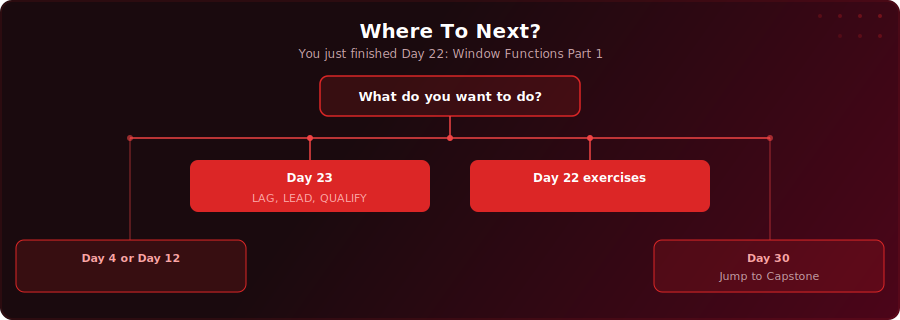

  

  
  
  

# Day 22 - Window Functions Part 1

[<< Day 21: Project: SaaS Trial-to-Paid Conversion](../day-21/) | [Day 23: Window Functions Part 2 >>](../day-23/)

---

## What You'll Learn

- How window functions calculate across rows without collapsing them (unlike GROUP BY)
- The difference between ROW_NUMBER, RANK, and DENSE_RANK - and when to use each one
- How NTILE splits rows into equal buckets (quartiles, deciles, percentiles)
- How PARTITION BY creates independent ranking windows within groups

---

## Where To Next?

  

---

  <a href="../day-21/">&#9664; Day 21: Project: SaaS Trial-to-Paid Conversion</a> &nbsp;&nbsp;|&nbsp;&nbsp; <a href="../day-23/">Day 23: Window Functions Part 2 &#9654;</a>

