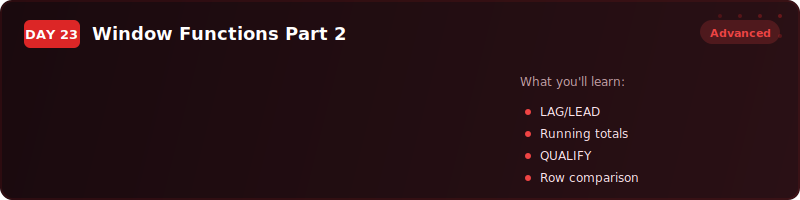
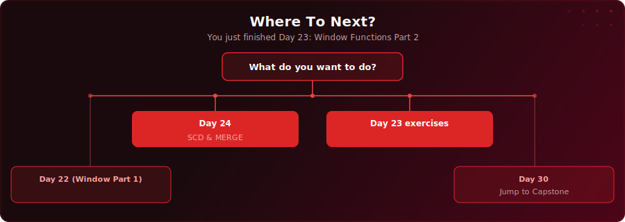

  

  
  
  

# Day 23 - Window Functions Part 2

[<< Day 22: Window Functions Part 1](../day-22/) | [Day 24: SCD Types & MERGE >>](../day-24/)

---

## What You'll Learn

- How to build running totals with SUM() OVER and cumulative aggregation
- How frame clauses (ROWS BETWEEN) power moving averages that smooth out noise
- How LAG and LEAD let you compare each row to its previous or next row for period-over-period analysis
- How FIRST_VALUE and LAST_VALUE anchor comparisons to fixed reference points

---

## Where To Next?

  

---

  <a href="../day-22/">&#9664; Day 22: Window Functions Part 1</a> &nbsp;&nbsp;|&nbsp;&nbsp; <a href="../day-24/">Day 24: SCD Types & MERGE &#9654;</a>

