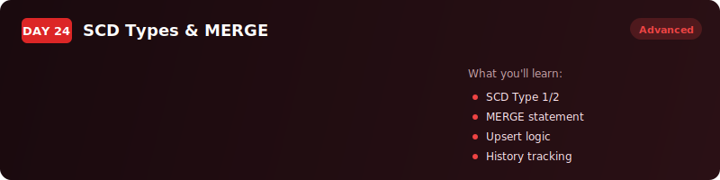
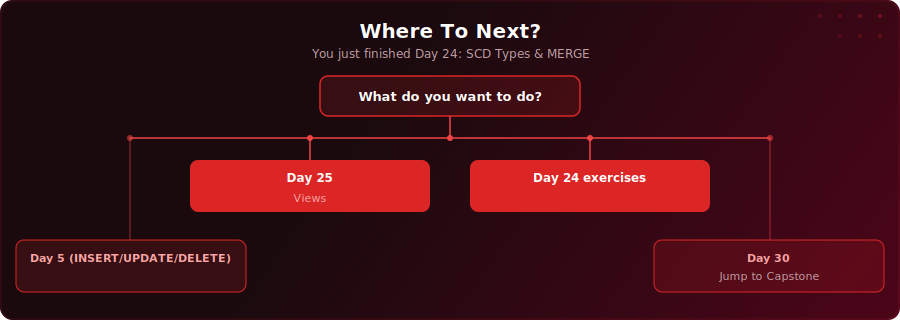

  

  
  
  

# Day 24 - SCD Types & MERGE

[<< Day 23: Window Functions Part 2](../day-23/) | [Day 25: Views & Materialised Views >>](../day-25/)

---

## What You'll Learn

- The four SCD (Slowly Changing Dimension) types and when to use each one
- How to implement SCD Type 2 with effective dates, end dates, and a current flag
- How to use MERGE for insert-or-update operations in a single statement
- How to use INSERT ... ON CONFLICT for PostgreSQL-native upserts

---

## Key Concepts

- **SCD Type 0** - retain the original value forever (e.g., signup date); never overwrite

---

## Where To Next?

  

---

  <a href="../day-23/">&#9664; Day 23: Window Functions Part 2</a> &nbsp;&nbsp;|&nbsp;&nbsp; <a href="../day-25/">Day 25: Views & Materialised Views &#9654;</a>

