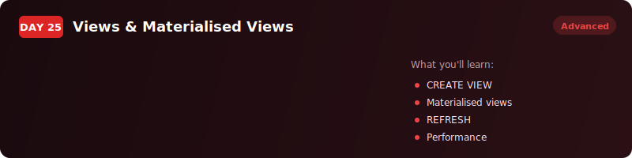
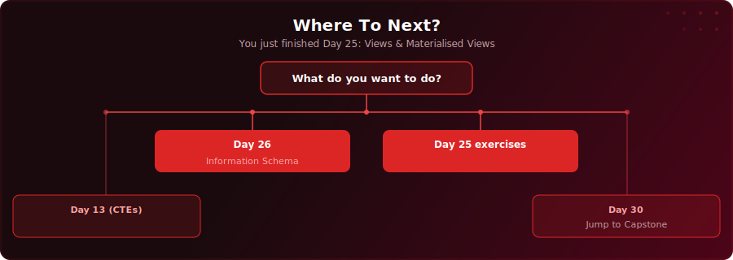

  

  
  
  

# Day 25 - Views & Materialised Views

[<< Day 24: SCD Types & MERGE](../day-24/) | [Day 26: Information Schema & Metadata >>](../day-26/)

---

## What You'll Learn

- How to save queries permanently as views so your entire team can reuse them without writing JOINs
- The difference between regular views (always fresh) and materialised views (pre-computed, instant reads)
- How to refresh materialised views - including CONCURRENTLY to avoid blocking readers
- When to use CTEs, views, materialised views, and tables

---

## Where To Next?

  

---

  <a href="../day-24/">&#9664; Day 24: SCD Types & MERGE</a> &nbsp;&nbsp;|&nbsp;&nbsp; <a href="../day-26/">Day 26: Information Schema & Metadata &#9654;</a>

