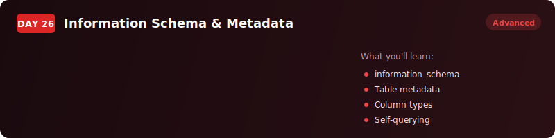
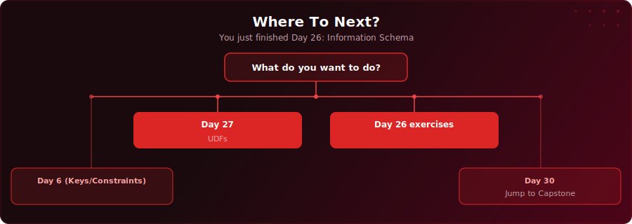

  

  
  
  

# Day 26 - Information Schema & Metadata

[<< Day 25: Views & Materialised Views](../day-25/) | [Day 27: CREATE FUNCTION (UDFs) >>](../day-27/)

---

## What You'll Learn

- How to query your database about itself using information_schema and pg_catalog
- How to list all tables, inspect columns, and map foreign key relationships with SQL
- How to use pg_catalog to find indexes, table owners, and column comments
- How to auto-generate a complete data dictionary from database metadata

---

## Where To Next?

  

---

  <a href="../day-25/">&#9664; Day 25: Views & Materialised Views</a> &nbsp;&nbsp;|&nbsp;&nbsp; <a href="../day-27/">Day 27: CREATE FUNCTION (UDFs) &#9654;</a>

