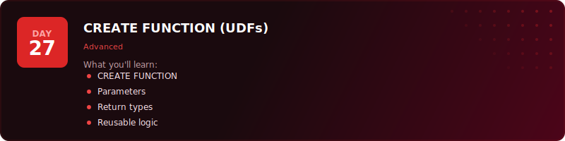
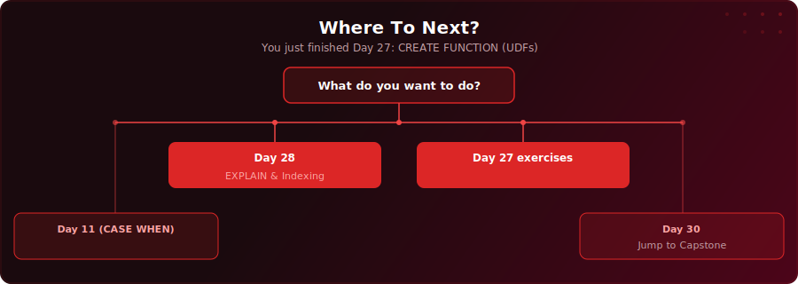

  

  
  
  

# Day 27 - CREATE FUNCTION (UDFs)

[<< Day 26: Information Schema & Metadata](../day-26/) | [Day 28: EXPLAIN & Indexing >>](../day-28/)

---

## What You'll Learn

- How to create reusable user-defined functions (UDFs) in PostgreSQL using PL/pgSQL
- The difference between scalar functions (one value) and set-returning functions (multiple rows)
- How to use parameters, default values, and the DECLARE block for local variables
- How volatility labels (IMMUTABLE, STABLE, VOLATILE) affect performance and correctness
- How to manage functions with DROP, CREATE OR REPLACE, and overloading

---

## Where To Next?

  

---

  <a href="../day-26/">&#9664; Day 26: Information Schema & Metadata</a> &nbsp;&nbsp;|&nbsp;&nbsp; <a href="../day-28/">Day 28: EXPLAIN & Indexing &#9654;</a>

