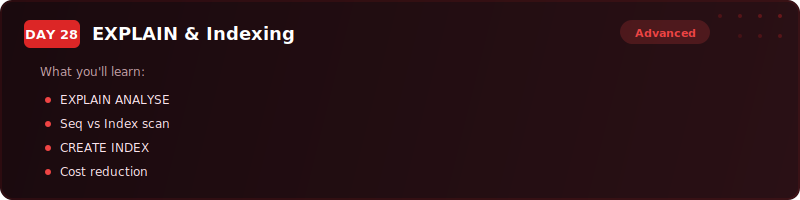
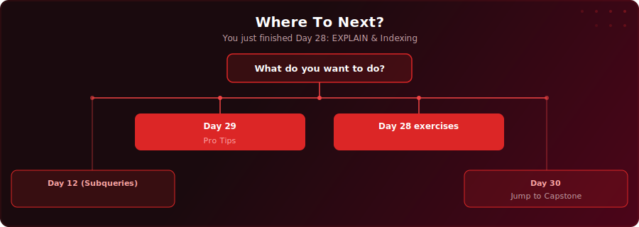

  

  
  
  

# Day 28 - EXPLAIN & Indexing

[<< Day 27: CREATE FUNCTION (UDFs)](../day-27/) | [Day 29: PostgreSQL Pro Tips >>](../day-29/)

---

## What You'll Learn

- How to use EXPLAIN and EXPLAIN ANALYSE to read PostgreSQL query execution plans
- The difference between Seq Scan, Index Scan, and Index Only Scan
- How to create B-tree, hash, GIN, and composite indexes
- Anti-patterns that silently break index usage (functions on columns, type mismatches, SELECT *, leading wildcards)
- When NOT to create indexes and why foreign key columns should always be indexed

---

## Where To Next?

  

---

  <a href="../day-27/">&#9664; Day 27: CREATE FUNCTION (UDFs)</a> &nbsp;&nbsp;|&nbsp;&nbsp; <a href="../day-29/">Day 29: PostgreSQL Pro Tips &#9654;</a>

---

<!-- CLIFFHANGER -->

<b>UP NEXT</b>

<a href="../README.md#curriculum"><b>Day 29 coming soon &raquo;</b></a>

<b>Day 29 &nbsp;&middot;&nbsp; PostgreSQL Pro Tips</b>

<i>The small habits separating slow from fast.</i>

<!-- /CLIFFHANGER -->
